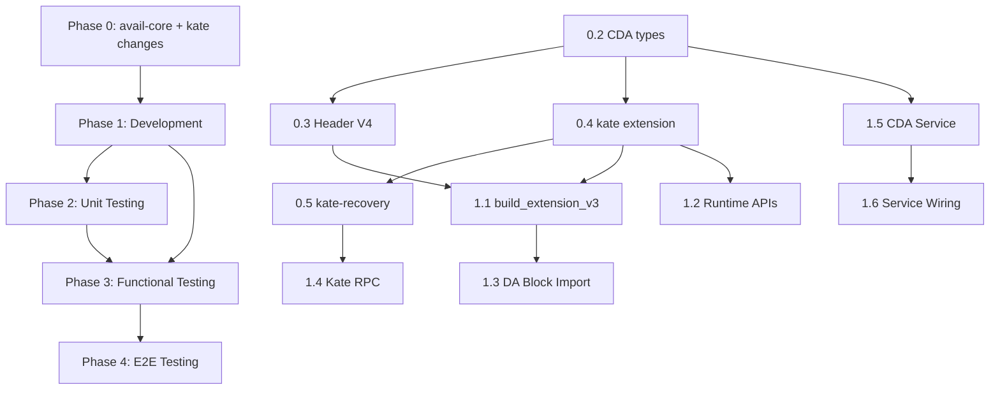

# Implementation Plan: Nang cap Avail sang kien truc CDA

---

## Tong quan kien truc hien tai vs Target

### Hien tai (Current)

- **avail-core** (external, `tag = core-node-12`): dinh nghia `HeaderExtension::V3`, `KateCommitment`, `DataLookup`, `AppExtrinsic`, `DataProof`
- **kate** (external, cung repo): grid construction, RS column extension (factor 2), polynomial grid, KZG single-cell proof va multiproof (BLS12-381 / `poly_multiproof`)
- **pallets/system**: `build_extension_v2.rs` build grid + commitment cho header extension
- **runtime/src/kate/native.rs**: `HostedKate` trait cung cap `grid`, `proof`, `multiproof`, `app_data`
- **node/src/da_block_import.rs**: verify header extension consistency khi import block
- **rpc/kate-rpc**: expose `kate_queryRows`, `kate_queryProof`, `kate_queryMultiProof`, `kate_queryDataProof`
- **Mang P2P**: Substrate standard (`sc-network`, libp2p, GRANDPA gossip) -- khong co subnet topology

### Target (tu `new-direct.md`)

- Ma tran 2D duoc mo rong RS: R x C -> 2R x C -> 2R x 2C
- Moi cell chia thanh **k pieces** theo chieu ngang
- KZG commitments **theo cot** tren ma tran mo rong, dua vao header extension
- **Segment MultiProof**: Light Client chi can 1 phep Pairing cho toan bo segment
- **RLNC encoding**: Store Node tao coded pieces + combined proof tu coding vector ngau nhien
- **4 loai node moi**: Validator, Full Node (+ bootstrap), Store Node, Fat Node
- **RDA**: PeerID -> grid position (deterministic hash), subnet Row/Column, bootstrap nodes

---

## Phase 0: Thay doi tren avail-core va thu vien lien quan

### Objective

Xay dung nen tang kieu du lieu, trait, va primitive can thiet truoc khi bat ky module nao trong `avail` node co the implement CDA logic.

### Detailed Tasks

**0.1 Fork va vendor avail-core locally**

- Uncomment path dependencies trong [Cargo.toml](Cargo.toml) (dong 28-30)
- Clone `availproject/avail-core` tag `core-node-12` vao `../avail-core/`
- Chuyen tu git dependency sang path dependency de phat trien dong thoi

**0.2 Dinh nghia kieu du lieu CDA moi trong avail-core**

Tao module moi `core/src/cda/mod.rs`:

- `CodingVector`: wrapper `Vec<Fr>` (k he so ngau nhien tu finite field)
- `RLNCPiece`: struct { `coded_data: Vec<u8>`, `coding_vector: CodingVector` }
- `RLNCProof`: combined proof tu coding vector + base multiproofs (homomorphic)
- `SegmentProof`: struct cho segment multiproof (single pairing verification)
- `GridPosition`: struct { `row: u16`, `col: u16` } (vi tri tren grid cua node)
- `SubnetId`: enum { `Row(u16)`, `Column(u16)` }
- `NodeRole`: enum { `Validator`, `FullNode`, `StoreNode`, `FatNode` }
- `PieceIndex`: index mot piece trong k pieces cua mot cell

**0.3 Mo rong header extension (V4)**

File: `core/src/header/extension/v4.rs` (moi), `core/src/header/extension/mod.rs`

- Them variant `V4(v4::HeaderExtension)` vao enum `HeaderExtension`
- V4 `HeaderExtension`:
  - `app_lookup: DataLookup`
  - `commitment: kc::v4::KateCommitment` (moi)
  - `grid_dims: GridDimensions` (original R x C)
  - `extended_dims: GridDimensions` (2R x 2C)
  - `k_factor: u16` (so pieces per cell)
- V4 `KateCommitment`: file `core/src/kate_commitment.rs`
  - `column_commitments: Vec<Vec<u8>>` (per-column KZG commitment tren ma tran 2Rx2C)
  - `data_root: H256`
  - `rows: u16`, `cols: u16`

**Backward compatibility**: Giu nguyen V3 variants, them V4; `HeaderVersion` enum them `V4 = 3`.

**0.4 Mo rong kate crate**

File: `kate/src/gridgen/` va `kate/src/com.rs`

- Mo rong `EvaluationGrid`:
  - Method `extend_full(row_factor, col_factor)` -> RS extension 2R x 2C (hien tai chi co `extend_columns(2)`)
  - Method `split_cells_horizontal(k: u16)` -> chia moi cell thanh k pieces
  - Method `column_commitments(srs)` -> Vec commitment per column (thay vi per row nhu hien tai)
- Tao module `kate/src/segment_proof.rs`:
  - `SegmentMultiProof`: struct bao gom proof cho nhieu diem trong 1 cot
  - `generate_segment_proof(srs, poly_grid, column, points)` -> SegmentProof
  - `verify_segment_proof(srs, commitment, segment_proof, points, values)` -> bool (1 pairing)
- Tao module `kate/src/rlnc.rs`:
  - `encode_rlnc(pieces: &[Vec<u8>], coding_vector: &CodingVector) -> RLNCPiece`
  - `decode_rlnc(coded_pieces: &[RLNCPiece]) -> Result<Vec<Vec<u8>>>` (matrix inversion)
  - `combine_proofs_homomorphic(proofs: &[Proof], coding_vector: &CodingVector) -> RLNCProof`
  - `generate_random_coding_vector(k: usize, rng: &mut impl Rng) -> CodingVector`

**0.5 Mo rong kate-recovery**

File: `kate/recovery/src/`

- Them verify logic cho `SegmentProof` (single pairing)
- Them RLNC decode logic cho Light Client / Full Node recovery path
- Them `verify_column_commitment(commitment, column_data, proof)` cho Fat Node verification

### Affected Files (avail-core repo)

- `core/src/lib.rs` -- them module `cda`
- `core/src/cda/mod.rs` -- **moi**
- `core/src/header/extension/mod.rs` -- them V4 variant
- `core/src/header/extension/v4.rs` -- **moi**
- `core/src/header_version/mod.rs` -- them V4
- `core/src/kate_commitment.rs` -- them v4 module
- `kate/src/lib.rs` -- them module exports
- `kate/src/gridgen/core.rs` -- extend grid methods
- `kate/src/com.rs` -- column commitment
- `kate/src/segment_proof.rs` -- **moi**
- `kate/src/rlnc.rs` -- **moi**
- `kate/recovery/src/` -- them verify functions

### Dependencies

- Khong co dependency nao tu avail repo -- day la lop co so nhat
- Can `poly_multiproof` (da co), `nalgebra` (da co), `rand`/`rand_chacha` (da co)

### Risks / Edge cases

- **Breaking change**: V4 header extension phai backward-compatible voi V3 (blocks cu van decode duoc)
- **SRS size**: KZG commitments per column tren 2Rx2C tang so commitments; can dam bao SRS `couscous` du degree (hien tai 1024)
- **Performance**: RS extension sang 2Rx2C se tang 4x so data; can benchmark som
- **RLNC field mismatch**: Coding vector phai o cung finite field voi polynomial evaluations (BLS12-381 Fr)

### Validation method

- `cargo test -p avail-core` pass (bao gom serialize/deserialize V3 va V4)
- `cargo test -p kate` pass (grid extension, column commitment, segment proof, RLNC encode/decode)
- `cargo test -p kate-recovery` pass (segment verify, RLNC decode)
- Backward compat test: decode V3 header extension tu mainnet block van thanh cong

---

## Phase 1: Development -- Trien khai logic CDA/Avail

### Objective

Implement day du CDA pipeline trong avail node: tu block production (Validator) -> data distribution (Full Node/Store Node) -> storage (Fat Node) -> proof service va verification.

### Detailed Tasks

**1.1 Cap nhat pallets/system -- Header Extension V4 Builder**

File: [pallets/system/src/native/build_extension_v3.rs](pallets/system/src/native/build_extension_v3.rs) (**moi**, khong sua v2 vi warning "do not change")

- Tao `build_extension_v3` function (API version 3 cua `HostedHeaderBuilder`)
- Logic:
  1. `EvaluationGrid::from_extrinsics(...)` (giu nguyen)
  2. **Moi**: `grid.extend_full(2, 2)` -- RS extension R x C -> 2R x 2C
  3. **Moi**: `grid.split_cells_horizontal(k)` -- chia cells thanh k pieces
  4. `grid.make_polynomial_grid()`
  5. **Moi**: `poly_grid.column_commitments(srs)` -- KZG commitment per column
  6. Build `HeaderExtension::V4(...)` voi `v4::KateCommitment`

File: [pallets/system/src/native/hosted_header_builder.rs](pallets/system/src/native/hosted_header_builder.rs)

- Them `#[version(3)]` cho `build` function goi `build_extension_v3`

File: [pallets/system/src/native/mod.rs](pallets/system/src/native/mod.rs)

- Them `build_extension_v3` module

**1.2 Cap nhat Runtime APIs**

File: [runtime/src/apis.rs](runtime/src/apis.rs)

- Tang `ExtensionBuilder` API version
- Them RPC methods moi:
  - `segment_proof(block_number, extrinsics, block_len, column, points)` -> SegmentProof
  - `column_data(block_number, extrinsics, block_len, column)` -> Vec data cho 1 column

File: [runtime/src/kate/native.rs](runtime/src/kate/native.rs)

- Them `HostedKate` methods:
  - `segment_proof(...)` -- generate segment multiproof cho 1 column
  - `column_data(...)` -- tra ve du lieu toan bo 1 column (cho Full Node proof service)

**1.3 Cap nhat DA Block Import**

File: [node/src/da_block_import.rs](node/src/da_block_import.rs)

- `ensure_valid_header_extension`: xu ly ca V3 va V4
- Voi V4: recompute column commitments va so sanh voi header
- Giu backward compat: V3 blocks van qua duoc pipeline cu

**1.4 Cap nhat Kate RPC**

File: [rpc/kate-rpc/src/lib.rs](rpc/kate-rpc/src/lib.rs)

- Them RPC endpoints moi:
  - `kate_querySegmentProof(column, points, at)` -> SegmentProof
  - `kate_queryColumnData(column, at)` -> column data
  - `kate_queryColumnCommitments(at)` -> per-column commitments
- Giu nguyen cac endpoints cu de backward compat

**1.5 Tao module Node Roles & CDA Service** [Major new component]

Tao thu muc `node/src/cda/` voi cac file:

- `node/src/cda/mod.rs` -- wiring va exports
- `node/src/cda/config.rs` -- CDA-specific config (k_factor, grid params, node role)
- `node/src/cda/grid_position.rs` -- PeerID -> (row, col) deterministic mapping (hash function)
- `node/src/cda/subnet.rs` -- Subnet Discovery Protocol
  - `SubnetManager`: quan ly membership cua Row Subnet va Column Subnet
  - Connect/disconnect peers khi join/leave
  - Bootstrap node logic: tham gia tat ca Row subnets
- `node/src/cda/store_node.rs` -- Store Node logic
  - Nhan raw data chunks tu Full Node
  - RLNC encode: sinh coding vector per Fat Node, tinh coded piece + combined proof
  - Gui goi tin (coding_vector, rlnc_piece, rlnc_proof) cho tung Fat Node trong column
  - Tu luu 1 coded piece cho chinh minh
- `node/src/cda/fat_node.rs` -- Fat Node logic
  - Nhan RLNC pieces tu Store Node
  - Verify qua Full Node (lay segment multiproof, check voi column commitment trong header)
  - Luu coded pieces
  - Tra lai coded pieces khi Store Node can reconstruct
  - Re-coding: tao coded pieces moi tu coded pieces da luu (khong can decode)
- `node/src/cda/full_node_service.rs` -- Full Node CDA extensions
  - Nhan block + expanded data tu validator
  - Chia data thanh chunks va phan phoi cho Store Nodes trong moi cell
  - On-demand proof service: sinh multiproof khi co request
  - Cache trung gian: polynomial, FFT, MSM results
  - Bootstrap node role: tham gia tat ca Row subnets
  - Fallback path: khi cell khong co honest node, ket noi truc tiep toi Fat Nodes qua bootstrap
- `node/src/cda/data_distribution.rs` -- STORE mechanism
  - Full Node -> Store Node: gui raw chunk + base proofs
  - Store Node -> Fat Node: gui RLNC pieces
  - Flow control va retry logic
- `node/src/cda/data_retrieval.rs` -- GET mechanism
  - Full Node request sampling -> Store Node thu thap tu Fat Nodes -> decode -> tra ve
  - Fallback path khi cell khong co honest Store Node
- `node/src/cda/sync.rs` -- State sync cho new nodes joining
  - Dong bo du lieu lich su tu Column peers
  - Timeout `delta_sync` (vd 15 phut)

**1.6 Cap nhat Node Service Wiring va CLI Flags**

#### CLI Flags Design (file: [node/src/cli.rs](node/src/cli.rs))

Hien tai da co san cac flags xac dinh role:
- **Validator**: `--validator` (co san tu Substrate `sc_cli::RunCmd`, kiem tra qua `role.is_authority()` trong [node/src/service.rs](node/src/service.rs) dong 477). **Khong can sua.**
- **Full Node**: Mac dinh khi khong truyen `--validator`. **Khong can sua.**

Them cac flags **moi** cho CDA node roles:

```rust
/// Run as a CDA Store Node.
/// Store nodes receive raw data from Full Nodes, encode with RLNC,
/// and distribute coded pieces to Fat Nodes in their custody column.
/// Mutually exclusive with --fat and --validator.
#[arg(long = "store", conflicts_with_all = &["fat", "validator"])]
pub cda_store: bool,

/// Run as a CDA Fat Node.
/// Fat nodes store RLNC-coded chunks received from Store Nodes
/// and serve them back on retrieval requests.
/// Mutually exclusive with --store and --validator.
#[arg(long = "fat", conflicts_with_all = &["store", "validator"])]
pub cda_fat: bool,

/// Enable this Full Node as a CDA bootstrap node.
/// Bootstrap nodes participate in ALL row subnets and help new nodes
/// discover peers. Only meaningful for Full Nodes (non-store, non-fat).
/// Validators act as bootstrap nodes automatically.
#[arg(long = "bootstrap")]
pub cda_bootstrap: bool,

/// The k-factor for CDA cell splitting (number of pieces per cell).
/// Default: 4. Applies to all CDA-aware node roles.
#[arg(long = "k-factor", default_value_t = 4)]
pub k_factor: u16,

/// Sync timeout for new CDA nodes joining a column subnet (in seconds).
/// Default: 900 (15 minutes).
#[arg(long = "cda-sync-timeout", default_value_t = 900)]
pub cda_sync_timeout: u64,
```

#### Bang tong hop flags theo role

- `./avail-node --validator` -- Validator (+ tu dong bootstrap). Block production + KZG commitment.
- `./avail-node` -- Full Node (default). Verify blocks + proof service + data distribution.
- `./avail-node --bootstrap` -- Full Node + bootstrap. Tham gia tat ca Row subnets.
- `./avail-node --store` -- Store Node. RLNC encode + distribute + decode on GET.
- `./avail-node --fat` -- Fat Node. Luu RLNC pieces + cung cap khi duoc yeu cau.

#### Conflicts & validation logic

Trong [node/src/command.rs](node/src/command.rs), them validation:
- `--store` va `--fat` mutually exclusive (clap `conflicts_with_all`)
- `--store` va `--validator` mutually exclusive
- `--fat` va `--validator` mutually exclusive
- `--bootstrap` chi co y nghia khi KHONG co `--store` hoac `--fat` (warn neu ket hop, nhung khong error)
- `--unsafe-da-sync` da co `conflicts_with_all = &["validator"]` -- giu nguyen, them `--store` vao conflict list vi Store Node can verify data

#### CdaRole enum derivation

Trong `node/src/cda/config.rs`, derive role tu CLI + Substrate role:

```rust
pub enum CdaRole {
    Validator,    // --validator (is_authority)
    FullNode,     // default, no special flag
    Bootstrap,    // --bootstrap (Full Node + all row subnets)
    StoreNode,    // --store
    FatNode,      // --fat
}

impl CdaRole {
    pub fn from_cli(cli: &Cli, substrate_role: &sc_service::Role) -> Self {
        if cli.cda_store { return CdaRole::StoreNode; }
        if cli.cda_fat { return CdaRole::FatNode; }
        if substrate_role.is_authority() { return CdaRole::Validator; }
        if cli.cda_bootstrap { return CdaRole::Bootstrap; }
        CdaRole::FullNode
    }
}
```

#### Service wiring theo role (file: [node/src/service.rs](node/src/service.rs))

Them conditional service startup dua tren `CdaRole`:

```rust
match cda_role {
    CdaRole::Validator => {
        // Existing: BABE authoring, GRANDPA voter, authority discovery
        // New: auto-join all row subnets as bootstrap
        // New: build V4 header extension during block production
    }
    CdaRole::FullNode | CdaRole::Bootstrap => {
        // Existing: GRANDPA voter, block import, Kate RPC
        // New: CDA data distribution worker (STORE mechanism)
        // New: CDA proof service worker (on-demand multiproof)
        // New: subnet manager (row + column subnets)
        // If Bootstrap: join ALL row subnets
        // If FullNode: join assigned row + column subnets
    }
    CdaRole::StoreNode => {
        // Existing: block import (but NO authoring, NO GRANDPA voting)
        // New: RLNC encoder worker
        // New: listen for chunks from Full Node
        // New: distribute coded pieces to Fat Nodes
        // New: GET responder (collect + decode + return)
        // New: subnet manager (assigned row + column subnets)
        // SKIP: Kate RPC proof endpoints (Store Node khong serve proofs)
    }
    CdaRole::FatNode => {
        // Existing: block import (header only, minimal state)
        // New: listen for RLNC pieces from Store Nodes
        // New: verify pieces via Full Node segment multiproof
        // New: serve coded pieces on GET requests
        // New: re-coding worker
        // New: subnet manager (assigned column subnet only)
        // SKIP: Kate RPC, GRANDPA voting, block authoring
    }
}
```

#### Dam bao chain chay tron tru -- Graceful degradation

- Neu `--store` hoac `--fat` duoc truyen nhung mang chua co CDA peers -> node van sync blocks binh thuong, chi log warning "No CDA peers found in subnet, waiting..."
- Neu khong co flag CDA nao (`--store`, `--fat`) -> node chay nhu hien tai, KHONG khoi dong bat ky CDA worker nao. Dam bao 100% backward compat voi cach chay cu.
- Feature gate: tat ca CDA workers wrap trong `if cda_enabled { ... }` check. `cda_enabled` = true khi bat ky CDA flag nao duoc truyen, HOAC khi runtime version >= V4.
- Cac RPC endpoints moi (segment proof, column data) chi duoc register khi node la Full Node hoac Validator, khong register cho Store/Fat de tranh confusion.

File: [node/src/rpc.rs](node/src/rpc.rs)

- Compose CDA RPC namespace moi, conditional theo `CdaRole`
- Store/Fat nodes: chi expose health/status RPC, khong expose kate proof RPC

#### Startup commands mau (Engram chain)

```bash
# Validator (CDA tu dong vi Engram genesis co cda_enabled=true)
./avail-node --chain engram --validator

# Full Node
./avail-node --chain engram

# Full Node + Bootstrap (tham gia tat ca row subnets)
./avail-node --chain engram --bootstrap --enable-kate-rpc

# Store Node
./avail-node --chain engram --store --k-factor 4

# Fat Node
./avail-node --chain engram --fat

# Dev mode voi CDA Store (de test local nhanh)
./avail-node --dev --store
```

#### Tom tat tat ca CLI flags theo node role

| Flag | Role | BABE/Author | GRANDPA Vote | Kate RPC | CDA Workers | Subnet |
|------|------|-------------|--------------|----------|-------------|--------|
| `--validator` | Validator | Co | Co | Tuy chon | Distribution | All Row (bootstrap) |
| _(default)_ | Full Node | Khong | Co | Tuy chon | Distribution + Proof | Row + Column |
| `--bootstrap` | Full Node + Bootstrap | Khong | Co | Nen bat | Distribution + Proof | All Row + Column |
| `--store` | Store Node | Khong | Khong | Khong | RLNC Encode/Decode | Row + Column |
| `--fat` | Fat Node | Khong | Khong | Khong | Storage + Serve | Column only |

**1.7 Dam bao chain chay tron tru -- Runtime Transition Strategy**

Khi chay tren chain rieng, can dam bao cac dieu kien sau:

**a) Runtime version bump:**
- Trong [runtime/src/version.rs](runtime/src/version.rs): tang `spec_version` khi deploy V4 header extension
- `HeaderVersion` chuyen tu V3 -> V4 phai duoc control boi on-chain governance (hoac genesis config cho dev chain)
- Truoc khi governance set V4, tat ca blocks van dung V3 -> khong break gi

**b) Chain spec cho custom chain:**
- Them CDA config vao genesis state trong chain spec ([node/src/chains/](node/src/chains/)):
  - `k_factor: 4`
  - `header_version: "V3"` (ban dau, chuyen V4 sau khi mang on dinh)
  - `cda_enabled: false` (ban dau, bat sau)
- Tao chain spec mau: `misc/genesis/cda-devnet.json`

**c) Migration path:**

*Truong hop Engram (chain moi):*
- Khong can migration. Genesis da set `header_version = V4`, `cda_enabled = true`
- Moi block tu block 1 deu dung V4 header extension
- Tat ca nodes khoi dong voi CDA tu dau

*Truong hop upgrade chain da ton tai (vd: testnet cu):*
1. Deploy binary moi voi `--chain your-chain` -- chay nhu cu vi `header_version` van la V3
2. Start cac Store/Fat nodes voi `--store` / `--fat` -- chung sync blocks binh thuong, chua lam gi CDA
3. Governance call: set `header_version = V4`, `cda_enabled = true`
4. Tu block tiep theo: Validators build V4 headers, Full Nodes phan phoi data, Store/Fat bat dau hoat dong
5. Neu can rollback: governance set lai V3 -> chain tiep tuc voi V3 headers

**d) Cac checks de chain khong bi treo:**
- `da_block_import.rs`: phai handle ca V3 va V4 -- neu block la V3, dung logic cu; neu V4, dung logic moi
- Store/Fat nodes khi khong co CDA data (V3 era): idle, chi sync blocks, khong crash
- RPC: cac endpoint cu van hoat dong binh thuong bat ke CDA state

**1.8 Tao chain spec "Engram" -- Chain doc lap hoan toan**

Engram la chain doc lap, KHONG phai fork tu Avail mainnet/turing. Co genesis rieng, validator set rieng, token rieng, va CDA-ready tu dau.

#### 1.8.1 Tao chain spec module

File: [node/src/chains/mod.rs](node/src/chains/mod.rs) -- them module `engram`:

```rust
pub mod engram {
    use super::*;
    use da_runtime::wasm_binary_unwrap;
    use sc_chain_spec::ChainType;

    pub fn chain_spec() -> ChainSpec {
        ChainSpec::builder(wasm_binary_unwrap(), Default::default())
            .with_name("Engram Network")
            .with_id("engram")
            .with_chain_type(ChainType::Live)  // hoac ::Local cho testnet
            .with_genesis_config_patch(genesis_constructor())
            .with_protocol_id("engram")
            .with_properties(engram_chain_properties())
            .with_boot_nodes(vec![])  // them boot nodes sau
            .build()
    }

    fn engram_chain_properties() -> sc_service::Properties {
        serde_json::json!({
            "ss58Format": 42,       // [co the doi sang custom prefix]
            "tokenDecimals": 18,
            "tokenSymbol": "EGM"    // token rieng cua Engram
        })
        .as_object().unwrap().clone()
    }

    fn genesis_constructor() -> Value {
        // 7 validators ban dau (co the dieu chinh 5-10)
        let alice = AuthorityKeys::from_seed("Alice");
        let bob = AuthorityKeys::from_seed("Bob");
        let charlie = AuthorityKeys::from_seed("Charlie");
        let dave = AuthorityKeys::from_seed("Dave");
        let eve = AuthorityKeys::from_seed("Eve");
        let ferdie = AuthorityKeys::from_seed("Ferdie");
        let greg = AuthorityKeys::from_seed("Greg");

        let sudo = alice.controller.clone();
        let validators = vec![alice, bob, charlie, dave, eve, ferdie, greg];

        runtime_genesis_config(
            sudo.clone(),
            vec![sudo.clone()],  // technical committee
            vec![sudo],          // treasury committee
            validators,
        )
    }
}
```

**Luu y ve `from_seed`**: Day la cach dung well-known keys de dev/test. Cho production, can generate real keys bang `avail-node key generate` va dung `AuthorityKeys::from_accounts(...)`.

#### 1.8.2 Dang ky trong CLI loader

File: [node/src/command.rs](node/src/command.rs) -- them vao match `load_spec`:

```rust
"engram" => Box::new(chains::engram::chain_spec()),
```

Sau khi them, chay chain bang: `./avail-node --chain engram`

#### 1.8.3 Tuy chinh genesis config cho Engram

Cac tham so can chinh trong `runtime_genesis_config` (file [node/src/chains/common.rs](node/src/chains/common.rs)) hoac override rieng cho engram:

- **validatorCount**: 7 (hoac 5-10 tuy deployment)
- **minimumValidatorCount**: 3 (dam bao >= 2/3 + 1 cho GRANDPA finality)
- **minValidatorBond**: co the giam xuong cho testnet (hien tai 100_000 AVAIL = kha cao)
- **blockLength**: giu nhu default hoac tang neu can throughput cao hon cho CDA
- **vector pallet**: co the de cau hinh rong (khong bridge sang Ethereum) -- xem chi tiet ben duoi
- **dataAvailability**: custom app_keys cho Engram

#### 1.8.4 Xu ly vector pallet -- chain doc lap khong can Ethereum bridge

Hien tai `runtime_genesis_config` bat buoc set cac constants cua `pallet-vector` (BROADCASTER, GENESIS_VALIDATOR_ROOT, STEP_VK, ROTATE_VK...) -- day la cau hinh bridge sang Ethereum.

Cho Engram (chain doc lap), co 2 lua chon:

- **Option A (don gian)**: Giu nguyen vector pallet nhung dung dummy/placeholder values trong genesis. Bridge se khong hoat dong nhung khong anh huong CDA pipeline. Day la cach nhanh nhat.
- **Option B (sach hon)**: Tao `engram_genesis_config()` rieng trong `node/src/chains/common.rs` (hoac file rieng), bo qua vector config hoac dung gia tri mac dinh. Can dam bao pallet-vector khong panic khi config la placeholder.

**Khuyen nghi**: Dung Option A truoc, chuyen sang Option B sau khi CDA on dinh.

#### 1.8.5 Tao genesis JSON cho deployment

Sau khi build, generate raw chain spec:

```bash
# Generate human-readable chain spec
./target/release/avail-node build-spec --chain engram > misc/genesis/engram.chain.spec.json

# Edit engram.chain.spec.json de:
# - Thay cac well-known keys bang real validator keys  
# - Set boot nodes
# - Dieu chinh balances, staking params

# Generate raw spec (dung cho production)
./target/release/avail-node build-spec --chain engram --raw > misc/genesis/engram.chain.raw.json
```

#### 1.8.6 Boot nodes va network topology

Cho mang 5-10 validators + CDA nodes:

```bash
# Validator 1 (cung la boot node)
./avail-node --chain engram --validator --name engram-val-1 \
  --port 30333 --rpc-port 9944 \
  --node-key <FIXED_NODE_KEY_1>

# Validator 2-7 (connect toi boot node)
./avail-node --chain engram --validator --name engram-val-2 \
  --bootnodes /ip4/<VAL1_IP>/tcp/30333/p2p/<VAL1_PEER_ID>

# Full Node + Bootstrap (CDA)
./avail-node --chain engram --bootstrap --enable-kate-rpc \
  --bootnodes /ip4/<VAL1_IP>/tcp/30333/p2p/<VAL1_PEER_ID>

# Store Node
./avail-node --chain engram --store \
  --bootnodes /ip4/<VAL1_IP>/tcp/30333/p2p/<VAL1_PEER_ID>

# Fat Node
./avail-node --chain engram --fat \
  --bootnodes /ip4/<VAL1_IP>/tcp/30333/p2p/<VAL1_PEER_ID>
```

#### 1.8.7 CDA genesis parameters

Them vao genesis config cua Engram (trong `da-control` pallet hoac custom genesis field):

```json
"dataAvailability": {
    "appKeys": [...],
    "kFactor": 4,
    "cdaEnabled": true,
    "headerVersion": "V4"
}
```

Dieu nay dam bao Engram chain khoi dong voi CDA tu block 1, khong can governance upgrade.

#### 1.8.8 Script tien ich

Tao `scripts/engram/` voi:
- `generate_keys.sh` -- generate validator keys cho 5-10 validators
- `generate_chainspec.sh` -- build va tao chain spec
- `start_network.sh` -- khoi dong toan bo mang (validators + CDA nodes)
- `docker-compose.yml` -- setup multi-node bang Docker

### Affected Files (Engram chain)

- `node/src/chains/mod.rs` -- them module `engram`
- `node/src/command.rs` -- them "engram" vao `load_spec`
- `node/src/chains/common.rs` -- co the them `engram_genesis_config()` rieng
- `misc/genesis/engram.chain.spec.json` -- **moi**
- `misc/genesis/engram.chain.raw.json` -- **moi**
- `scripts/engram/` -- **moi** (cac scripts tien ich)

---

**1.9 Cap nhat da-control pallet**

File: [pallets/dactr/src/lib.rs](pallets/dactr/src/lib.rs)

- Them storage items: `KFactor` (config), `GridDimensions` (extended), `CdaEnabled` (bool)
- Them extrinsic/config cho CDA parameters (optional governance)
- Genesis config: `k_factor`, `cda_enabled`, `header_version`

### Affected Files


| Area           | Files                                                                                                                                                                  |
| -------------- | ---------------------------------------------------------------------------------------------------------------------------------------------------------------------- |
| pallets/system | `native/build_extension_v3.rs` (moi), `native/mod.rs`, `native/hosted_header_builder.rs`                                                                               |
| runtime        | `src/apis.rs`, `src/kate/native.rs`, `src/kate/mod.rs`, `src/lib.rs`                                                                                                   |
| node           | `src/da_block_import.rs`, `src/service.rs`, `src/cli.rs`, `src/rpc.rs`, `src/lib.rs`                                                                                   |
| node/cda (moi) | `mod.rs`, `config.rs`, `grid_position.rs`, `subnet.rs`, `store_node.rs`, `fat_node.rs`, `full_node_service.rs`, `data_distribution.rs`, `data_retrieval.rs`, `sync.rs` |
| rpc            | `kate-rpc/src/lib.rs`                                                                                                                                                  |
| pallets/dactr  | `src/lib.rs`                                                                                                                                                           |


### Dependencies

- Phase 0 hoan thanh (avail-core types, kate crate extensions)
- `poly_multiproof` (da co)
- `nalgebra` (da co, cho RLNC matrix ops)
- `rand`/`rand_chacha` (da co, cho coding vector generation)
- **Khong them framework moi**. Subnet/P2P logic xay tren `sc-network` / libp2p da co san

### Risks / Edge cases

- **Block production time**: RS 2Rx2C + column commitments nang hon hien tai; can profiling
- **V3 -> V4 transition**: blocks cu phai van import duoc; runtime upgrade phai set `HeaderVersion::V4` qua governance
- **Subnet partition**: neu grid thua lon so voi so nodes, co cells trong -> fallback logic phai robust
- **RLNC decode failure**: neu khong du coded pieces (< k), can retry hoac bao loi ro rang
- **Network layer coupling**: subnet logic phai tich hop duoc voi sc-network ma khong break consensus gossip

### Validation method

- `cargo build --locked --release` thanh cong
- Dev node (`--dev`) voi `--cda-enabled` khoi dong khong loi
- Block production voi V4 header extension thanh cong
- Kate RPC moi tra ve ket qua dung dinh dang

---

## Phase 2: Unit Testing -- Kiem tra tung ham/module

### Objective

Dam bao moi function/module moi hoat dong dung o cap do don vi, bao gom ca edge cases va error paths.

### Detailed Tasks

**2.1 Unit tests cho avail-core CDA types**

- Serialize/deserialize `CodingVector`, `RLNCPiece`, `GridPosition`, `NodeRole`
- `HeaderExtension::V4` encode/decode roundtrip
- `KateCommitment::v4` field validation
- Backward compat: decode V3 bytes thanh cong, V3 code khong bi anh huong boi V4

**2.2 Unit tests cho kate grid extension**

- `extend_full(2,2)`: verify ma tran 2Rx2C dung khi cho data biet truoc
- `split_cells_horizontal(k)`: verify k pieces co kich thuoc dung, ghep lai bang original
- `column_commitments()`: verify commitment per column khop khi verify rieng le
- Edge cases: empty grid, grid 1x1, grid vuot qua SRS degree

**2.3 Unit tests cho kate segment proof**

- `generate_segment_proof`: tao proof cho 1 column, nhieu diem
- `verify_segment_proof`: verify thanh cong voi dung data, that bai voi sai data
- Single pairing verification: dam bao chi dung 1 pairing operation
- Edge: column chi co 1 cell, column day du

**2.4 Unit tests cho kate RLNC**

- `encode_rlnc`: voi k=4, verify coded piece kich thuoc 1/k
- `decode_rlnc`: roundtrip encode -> decode = original
- `combine_proofs_homomorphic`: combined proof verify thanh cong
- Edge: k=1 (degenerate), coding vector co zero element, insufficient pieces for decode

**2.5 Unit tests cho node CDA modules**

- `grid_position`: PeerID hash -> deterministic (row,col), distribution deu
- `subnet`: join/leave subnet, bootstrap node membership, peer discovery
- `store_node`: RLNC encode flow, coding vector uniqueness per Fat Node
- `fat_node`: receive + verify + store flow, re-coding correctness
- `data_distribution`: STORE mechanism end-to-end voi mock network
- `data_retrieval`: GET mechanism voi mock, bao gom fallback path
- `sync`: timeout handling, partial sync recovery

**2.6 Unit tests cho updated components**

- `build_extension_v3`: so sanh output voi expected V4 header extension
- `da_block_import`: V3 block van pass, V4 block pass, mismatched V4 fail
- Kate RPC: mock runtime API, verify response format

### Affected Files

- `core/src/cda/tests.rs` (moi)
- `kate/src/gridgen/tests/` (mo rong)
- `kate/src/segment_proof.rs` (inline tests)
- `kate/src/rlnc.rs` (inline tests)
- `kate/recovery/src/tests/` (mo rong)
- `pallets/system/src/tests.rs` (mo rong)
- `node/src/cda/*/tests.rs` hoac inline `#[cfg(test)]`
- `runtime/src/kate/tests.rs` (moi hoac inline)
- `rpc/kate-rpc/src/` (mo rong tests)

### Dependencies

- Phase 1 code hoan thanh (hoac tung module khi xong)
- Mock infrastructure: [pallets/mocked_runtime/](pallets/mocked_runtime/) co the reuse

### Risks / Edge cases

- Test cho crypto operations (KZG, pairing) can SRS initialization -- co the cham; can `#[ignore]` cho CI nhanh
- RLNC decode test voi random vectors co the flaky neu RNG khong deterministic -- dung fixed seed

### Validation method

- `cargo test --workspace` pass 100%
- Coverage report cho cac module moi >= 80%
- CI pipeline ([.github/workflows/unit_tests.yml](.github/workflows/unit_tests.yml)) pass

---

## Phase 3: Functional Testing -- Kiem tra su phoi hop giua cac node

### Objective

Verify interaction patterns giua Validator, Full Node, Store Node, va Fat Node trong moi truong multi-node local.

### Detailed Tasks

**3.1 Setup test harness multi-node**

- Mo rong [e2e/](e2e/) framework (hien tai co `Cargo.toml` rieng, `src/tests/`)
- Tao test utilities de spawn nhieu node voi cac roles khac nhau
- Chain spec cho test network voi CDA parameters (k_factor, grid dims)

**3.2 Test: Validator -> Full Node block propagation voi V4**

- Validator produce block voi V4 header extension
- Full Node nhan, verify column commitments, import thanh cong
- Kiem tra: commitment trong header khop voi recomputed commitments

**3.3 Test: Full Node -> Store Node data distribution (STORE)**

- Full Node nhan block, chia data thanh chunks
- Gui chunks + base proofs cho Store Nodes trong moi cell
- Verify Store Nodes nhan du data

**3.4 Test: Store Node -> Fat Node RLNC distribution**

- Store Node encode RLNC voi random coding vectors
- Gui coded pieces cho tung Fat Node
- Fat Node verify qua Full Node (segment multiproof)
- Fat Node luu coded pieces
- Verify: moi Fat Node co coded piece khac nhau (different coding vector)

**3.5 Test: GET mechanism -- sampling flow**

- Full Node request sample tai vi tri [r,c]
- Store Node thu thap coded pieces tu Fat Nodes
- Store Node decode RLNC -> tra ve original symbol
- Full Node verify symbol voi commitment

**3.6 Test: Fallback mechanism**

- Tat Store Nodes tai cell [r,c]
- Full Node kich hoat fallback: ket noi truc tiep toi Fat Nodes qua bootstrap
- Full Node tu thu thap RLNC pieces va decode
- Verify: data van recovered thanh cong

**3.7 Test: Node join (RDA)**

- New node join network
- Hash PeerID -> grid position
- Gia nhap Row va Column subnets
- Dong bo du lieu lich su tu Column peers
- Verify: sau sync, node co the phuc vu GET requests

**3.8 Test: Bootstrap node functionality**

- Full Node lam bootstrap, tham gia tat ca Row subnets
- New node hoi bootstrap de tim peers
- Verify: routing chinh xac qua bootstrap

### Affected Files

- `e2e/src/tests/cda_functional.rs` (moi)
- `e2e/src/tests/rda_networking.rs` (moi)
- `e2e/Cargo.toml` (them dependencies)
- `scripts/` -- them script spawn multi-node test

### Dependencies

- Phase 1 hoan thanh (tat ca CDA modules)
- Phase 2 hoan thanh (unit tests pass, dam bao components dung)
- Local multi-node environment (co the dung docker hoac direct process spawn)

### Risks / Edge cases

- **Timing**: async network operations co the non-deterministic -> dung timeout + retry trong tests
- **Port conflicts**: nhieu nodes tren cung machine -> can dynamic port allocation
- **Resource**: nhieu nodes + KZG ops co the heavy tren CI -> co the can dedicated runner

### Validation method

- Tat ca functional tests pass trong CI
- Log output cho thay dung roles va interactions
- Network metrics (connections, subnets) dung nhu expected

---

## Phase 4: End-to-End Testing -- Mo phong luong du lieu hoan chinh

### Objective

Mo phong toan bo lifecycle tu luc du lieu duoc xuat ban den khi Light Client xac minh thanh cong bang segment multiproof voi 1 phep Pairing.

### Detailed Tasks

**4.1 Setup E2E test network**

- 3+ Validators (BABE/GRANDPA)
- 2+ Full Nodes (1 lam bootstrap)
- 4+ Store Nodes (phan bo tren grid)
- 8+ Fat Nodes (phan bo tren cac columns)
- 1+ Light Client (simulated)
- Chain spec `engram` voi CDA enabled tu genesis, k_factor=4, header_version=V4

**4.2 E2E Test: Complete data lifecycle**

```
Step 1: User submit data extrinsic (qua submit_data cua da-control pallet)
    |
Step 2: Validator build block
    - Construct 2D matrix
    - RS extension -> 2R x 2C
    - Split cells -> k pieces
    - Compute column KZG commitments
    - Build V4 header extension
    - Produce block
    |
Step 3: Block propagation
    - Full Nodes nhan va verify block
    - Column commitments match
    |
Step 4: Data distribution (STORE)
    - Full Node chia data thanh chunks per cell
    - Gui toi Store Nodes
    - Store Nodes RLNC encode va gui toi Fat Nodes
    - Fat Nodes verify va luu
    |
Step 5: Light Client sampling (DAS)
    - Chon ngau nhien cac vi tri [r,c]
    - Gui request toi Full Node
    - Full Node tra ve segment data + segment multiproof
    |
Step 6: Light Client verification
    - Verify segment multiproof voi 1 phep Pairing:
      e(pi_segment, [s^m - a^m]_2) = e(C - [P(a)]_1, g_2)
    - Ket luan data availability
    |
Step 7: Data retrieval (GET)
    - Full Node request symbol tai [r,c]
    - Store Node collect coded pieces tu Fat Nodes
    - Decode RLNC -> original symbol
    - Verify voi commitment
    |
Step 8: Verify fallback
    - Kill mot so Store Nodes
    - Full Node fallback qua bootstrap -> Fat Nodes
    - Van recover data thanh cong
```

**4.3 E2E Test: Backward compatibility**

- Mixed network: mot so nodes chay V3, mot so V4
- V3 blocks van duoc import boi V4 nodes
- Transition: runtime upgrade tu V3 sang V4

**4.4 E2E Test: Adversarial scenarios**

- Fat Node gui sai data -> verification that bai, data bi reject
- Store Node khong gui du coded pieces -> decode that bai, fallback kick in
- Cell khong co honest node -> fallback qua bootstrap

**4.5 E2E Test: Performance benchmarks**

- Block production time voi CDA vs hien tai
- Proof generation time (segment multiproof)
- RLNC encode/decode throughput
- Network overhead (subnet messages)

### Affected Files

- `e2e/src/tests/cda_e2e.rs` (moi)
- `e2e/src/tests/cda_backward_compat.rs` (moi)
- `e2e/src/tests/cda_adversarial.rs` (moi)
- `e2e/src/tests/cda_benchmark.rs` (moi)
- `scripts/cda_e2e_network.sh` (moi) -- spawn test network
- Chain spec files: `misc/genesis/engram.chain.spec.json`, `misc/genesis/engram.chain.raw.json`
- `runtime/benches/` -- them CDA benchmarks

### Dependencies

- Phase 3 hoan thanh (functional tests pass)
- Docker environment hoac bare-metal test cluster
- Light Client simulator (co the dung existing `kate-recovery` + custom test harness)

### Risks / Edge cases

- **Flaky tests**: network timing, process startup order -> can robust health checks
- **Resource intensive**: nhieu nodes + crypto ops -> CI may can high-memory runners
- **Chain upgrade test**: can careful runtime migration tu V3 -> V4
- **Light Client**: hien khong nam trong repo -> can mock hoac implement minimal client

### Validation method

- E2E test suite pass end-to-end
- Light Client verify thanh cong voi 1 Pairing
- Data recovery thanh cong qua ca normal va fallback paths
- Backward compat: V3 blocks import OK tren V4 network
- Performance benchmarks nam trong acceptable range (block time < 20s, proof gen < 2s)

---

## Dependency Graph giua cac Phases




---

## Assumptions

- [Assumption] `avail-core` se duoc fork va develop locally (path dependency) thay vi upstream PR truoc -- can confirm voi team
- [Assumption] SRS `couscous` (degree 1024) du cho grid dimensions moi voi 2Rx2C; neu khong, can upgrade SRS
- [Assumption] `k_factor` (so pieces per cell) se la runtime config, mac dinh 4
- [Assumption] Subnet discovery dung tren `sc-network` request-response protocol, khong can them network crate moi
- [Assumption] Light Client khong nam trong repo nay; E2E test se mock/simulate Light Client behavior
- [Assumption] RLNC finite field = BLS12-381 scalar field (Fr) -- cung field voi KZG

