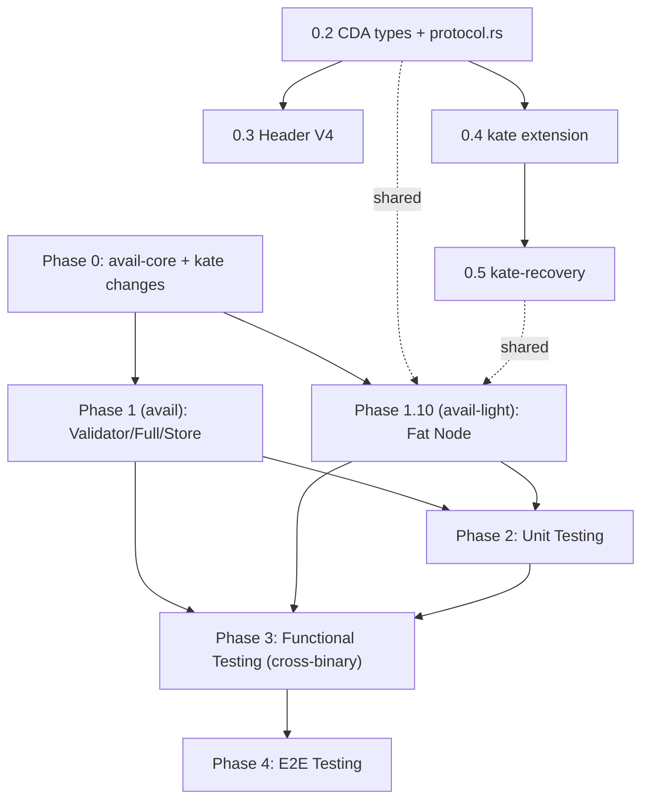
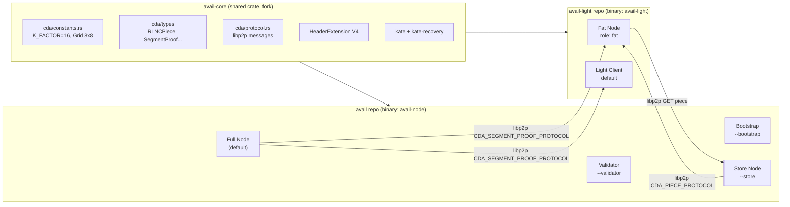

# Implementation Plan: Nang cap Avail sang kien truc CDA

---

## Tong quan kien truc hien tai vs Target

### Hien tai (Current)

- **avail-core** (external, `tag = core-node-12`): dinh nghia `HeaderExtension::V3`, `KateCommitment`, `DataLookup`, `AppExtrinsic`, `DataProof`
- **kate** (external, cung repo): grid construction, RS column extension (factor 2), polynomial grid, KZG single-cell proof va multiproof (BLS12-381 / `poly_multiproof`)
- **pallets/system**: `build_extension_v2.rs` build grid + commitment cho header extension
- **runtime/src/kate/native.rs**: `HostedKate` trait cung cap `grid`, `proof`, `multiproof`, `app_data`
- **node/src/da_block_import.rs**: verify header extension consistency khi import block
- **rpc/kate-rpc**: expose `kate_queryRows`, `kate_queryProof`, `kate_queryMultiProof`, `kate_queryDataProof`
- **Mang P2P**: Substrate standard (`sc-network`, libp2p, GRANDPA gossip) -- khong co subnet topology

### Target (tu `new-direct.md`)

- Ma tran 2D duoc mo rong RS: R x C -> 2R x C -> 2R x 2C
- Moi cell chia thanh **k pieces** theo chieu ngang
- KZG commitments **theo cot** tren ma tran mo rong, dua vao header extension
- **Segment MultiProof**: Light Client chi can 1 phep Pairing cho toan bo segment
- **RLNC encoding**: Store Node tao coded pieces + combined proof tu coding vector ngau nhien
- **Node roles** (phan bo giua 2 repo):
  - Trong repo `avail` (nay): Validator, Full Node (+ bootstrap), **Store Node**
  - Trong repo `avail-light` (rieng): **Fat Node**, Light Client
- **RDA**: PeerID -> grid position (deterministic hash), subnet Row/Column, bootstrap nodes

### Phan chia trach nhiem giua 2 repositories

| Repo | Role | Binary |
|------|------|--------|
| `avail` (nay) | Validator, Full Node, Bootstrap, Store Node | `avail-node` |
| `avail-light` (fork rieng) | Fat Node, Light Client | `avail-light` |

Ly do tach Fat Node sang `avail-light`:
- Fat Node khong can chay full Substrate runtime -- chi can:
  - Track block headers (da co trong avail-light)
  - Lay column commitments tu header V4
  - Verify RLNC pieces bang segment multiproof (Light Client da verify KZG)
  - Luu tru RLNC pieces + serve on request
- Tai nguyen nhe hon full node, phu hop hardware cua home users
- Tan dung hien co cua avail-light: network layer, DAS sampling, header sync, config system

---

## Hang so ky thuat cho Engram (**FIXED** -- khong cau hinh runtime)

| Hang so | Gia tri | Y nghia |
|---------|---------|---------|
| `K_FACTOR` | **16** | So pieces moi cell duoc chia theo chieu ngang (RLNC basis) |
| `MATRIX_CHUNKS` | **16** | So chunks chia tu ma tran de gui toi Store Nodes (= 1 chunk per extended column) |
| `GRID_ROWS_ORIGINAL` | **8** | So hang ma tran du lieu goc |
| `GRID_COLS_ORIGINAL` | **8** | So cot ma tran du lieu goc |
| `GRID_ROWS_EXTENDED` | **16** | Sau RS 2R mo rong |
| `GRID_COLS_EXTENDED` | **16** | Sau RS 2C mo rong |
| `P2P_ROWS` | **8** | So row subnets trong topology (mirror original grid) |
| `P2P_COLS` | **8** | So column subnets trong topology (mirror original grid) |
| Total cells (extended) | **256** | 16 × 16 |
| Total pieces per block | **4096** | 16 × 16 × 16 |

### Quan he giua P2P topology (8x8) va data grid extended (16x16)

- Vi P2P chi co 8 column subnets nhung extended matrix co 16 cot:
  - Extended column `c` (0..16) -> P2P subnet column `c / 2` (2 cot extended cung 1 subnet)
- Tuong tu voi row: extended row `r` (0..16) -> P2P subnet row `r / 2`
- Moi P2P cell `[r_sub, c_sub]` chiu trach nhiem cho **4 cells extended** (2x2 block)

### Cac hang so dinh nghia o dau

Tao file **`core/src/cda/constants.rs`** (trong avail-core fork):

```rust
pub const K_FACTOR: u16 = 16;
pub const MATRIX_CHUNKS: u16 = 16;

pub const GRID_ROWS_ORIGINAL: u16 = 8;
pub const GRID_COLS_ORIGINAL: u16 = 8;
pub const GRID_ROWS_EXTENDED: u16 = GRID_ROWS_ORIGINAL * 2;
pub const GRID_COLS_EXTENDED: u16 = GRID_COLS_ORIGINAL * 2;

pub const P2P_ROWS: u16 = 8;
pub const P2P_COLS: u16 = 8;

pub const fn p2p_row_from_extended(r: u16) -> u16 { r / 2 }
pub const fn p2p_col_from_extended(c: u16) -> u16 { c / 2 }
```

### Tai sao fix cung cac gia tri nay?

- Dam bao moi node trong mang tinh toan **cung grid dimensions**, khong can governance voting
- Don gian hoa logic: khong can storage `KFactor`/`GridDimensions` trong pallet
- SRS degree 1024 (couscous) du cho polynomial degree 256 (16×16) sau khi extended × 2 = 512 <= 1024 OK
- Phu hop voi so validators 5-10 va so luong Store/Fat nodes thuc te (it nhat 64 nodes cho grid 8x8 populated)

---

## Progress Tracking -- File `progress.md`

**Quy tac bat buoc**: Moi khi hoan thanh 1 feature/sub-task (tuong ung voi 1 muc trong todo list hoac 1 phan nho trong Detailed Tasks), phai ghi note vao file [progress.md](progress.md) o root repository.

### Cau truc `progress.md`

```markdown
# CDA Implementation Progress

## Phase 0: avail-core + kate extensions (shared)
- [x] 0.1 Fork avail-core (date: 2026-04-20)
- [x] 0.2 CDA types + protocol.rs defined (date: 2026-04-21)
- [ ] 0.3 HeaderExtension V4 added
- [ ] 0.4 kate crate extended (extend_full, column_commitments, segment_proof, rlnc)
- [ ] 0.5 kate-recovery extended

## Phase 1: Development (repo `avail`)
- [ ] 1.1 build_extension_v3.rs created (V4 header builder)
- [ ] 1.2 Runtime APIs updated
- [ ] 1.3 DA Block Import V3+V4
- [ ] 1.4 Kate RPC new endpoints
- [ ] 1.5 node/src/cda module (no fat_node.rs)
- [ ] 1.6 CLI flags + service wiring (--store, --bootstrap)
- [ ] 1.7 Runtime transition strategy
- [ ] 1.8 Engram chain spec
- [ ] 1.9 da-control pallet updates

## Phase 1.10: avail-light fork (repo `avail-light`)
- [ ] 1.10.1 Fork avail-light, switch to avail-core path dependency
- [ ] 1.10.2 AvailLightRole enum + CLI flag
- [ ] 1.10.3 src/cda module (fat_node.rs, re_coding.rs, subnet.rs, storage.rs)
- [ ] 1.10.4 Shared protocol.rs in avail-core
- [ ] 1.10.5 Config YAML cho Fat Node
- [ ] 1.10.6 HTTP API mo rong (GET /v1/cda/pieces/...)
- [ ] 1.10.7 Light Client dung segment multiproof (1 Pairing)

## Phase 2-4: Testing
- [ ] 2.x Unit tests (both repos)
- [ ] 3.x Functional tests (cross-binary)
- [ ] 4.x E2E tests (engram network)

## Notes & Decisions
- 2026-04-20: Used `K_FACTOR = 16` as constant instead of runtime config
- 2026-04-XX: Moved Fat Node to avail-light binary (cross-binary architecture)
...

## Blockers / Issues Found
- [Date] [Short description]
...

## Cross-binary version compatibility log
- avail-node vX.Y.Z <-> avail-light vA.B.C: [compatible | incompatible + reason]
```

### Quy tac cap nhat

1. Khi bat dau 1 feature: them `- [ ] X.Y Description` vao section tuong ung
2. Khi hoan thanh: doi `[ ]` thanh `[x]` va them `(date: YYYY-MM-DD)`
3. Ghi lai cac **decision** quan trong (chon option A vs B, doi hang so, ...)
4. Ghi lai **blockers** khi gap su co kho giai quyet
5. **Chi dung 1 file duy nhat** -- khong tao nhieu file progress con

---

## Phase 0: Thay doi tren avail-core va thu vien lien quan

### Objective

Xay dung nen tang kieu du lieu, trait, va primitive can thiet truoc khi bat ky module nao trong `avail` node co the implement CDA logic.

### Detailed Tasks

**0.1 Fork va vendor avail-core locally**

- Uncomment path dependencies trong [Cargo.toml](Cargo.toml) (dong 28-30)
- Clone `availproject/avail-core` tag `core-node-12` vao `../avail-core/`
- Chuyen tu git dependency sang path dependency de phat trien dong thoi

**0.2 Dinh nghia kieu du lieu CDA moi trong avail-core**

Tao module moi `core/src/cda/mod.rs` va `core/src/cda/constants.rs` (xem section "Hang so ky thuat cho Engram" o dau plan):

- `CodingVector`: wrapper `[Fr; 16]` (16 he so co dinh tu finite field BLS12-381 Fr, vi K_FACTOR=16)
- `RLNCPiece`: struct { `coded_data: Vec<u8>`, `coding_vector: CodingVector }` -- mat overhead 16×32 = 512 bytes per piece
- `RLNCProof`: combined proof tu coding vector + base multiproofs (homomorphic)
- `SegmentProof`: struct cho segment multiproof (single pairing verification)
- `GridPosition`: struct { `row: u16` (0..8), `col: u16` (0..8) } -- toa do P2P subnet cua node
- `SubnetId`: enum { `Row(u16)`, `Column(u16)` } (index 0..8)
- `NodeRole`: enum { `Validator`, `FullNode`, `Bootstrap`, `StoreNode`, `FatNode` } -- `FatNode` duoc dung boi avail-light
- `PieceIndex`: u16 (0..16)

**Quan trong**: Cac kieu tren (dac biet `RLNCPiece`, `CodingVector`, `SegmentProof`, `GridPosition`, `SubnetId`, `NodeRole`) la **shared types** giua `avail` va `avail-light` qua crate `avail-core`. Day la ly do dat chung trong avail-core thay vi rieng trong tung repo.

**0.3 Mo rong header extension (V4)**

File: `core/src/header/extension/v4.rs` (moi), `core/src/header/extension/mod.rs`

- Them variant `V4(v4::HeaderExtension)` vao enum `HeaderExtension`
- V4 `HeaderExtension` (toi gian -- dung hang so thay vi field):
  - `app_lookup: DataLookup`
  - `commitment: kc::v4::KateCommitment` (moi)
  - **KHONG** chua `grid_dims`, `extended_dims`, `k_factor` -- day la **hang so** trong `cda::constants`, moi node dung chung
- V4 `KateCommitment`: file `core/src/kate_commitment.rs`
  - `column_commitments: [Vec<u8>; 16]` (16 KZG commitments, mot cho moi extended column)
  - `data_root: H256`

**Header extension size V4**: 16 × 48 bytes (per commitment) + 32 bytes (data_root) + app_lookup ≈ **~800-1000 bytes**. Co chap nhan duoc.

**Backward compatibility**: Giu nguyen V3 variants, them V4; `HeaderVersion` enum them `V4 = 3`. Engram genesis set `header_version = V4` tu block 1.

**0.4 Mo rong kate crate**

File: `kate/src/gridgen/` va `kate/src/com.rs`

- Mo rong `EvaluationGrid`:
  - Method `extend_full(row_factor, col_factor)` -> RS extension 2R x 2C (hien tai chi co `extend_columns(2)`)
  - Method `split_cells_horizontal(k: u16)` -> chia moi cell thanh k pieces
  - Method `column_commitments(srs)` -> Vec commitment per column (thay vi per row nhu hien tai)
- Tao module `kate/src/segment_proof.rs`:
  - `SegmentMultiProof`: struct bao gom proof cho nhieu diem trong 1 cot
  - `generate_segment_proof(srs, poly_grid, column, points)` -> SegmentProof
  - `verify_segment_proof(srs, commitment, segment_proof, points, values)` -> bool (1 pairing)
- Tao module `kate/src/rlnc.rs`:
  - `encode_rlnc(pieces: &[Vec<u8>], coding_vector: &CodingVector) -> RLNCPiece`
  - `decode_rlnc(coded_pieces: &[RLNCPiece]) -> Result<Vec<Vec<u8>>>` (matrix inversion)
  - `combine_proofs_homomorphic(proofs: &[Proof], coding_vector: &CodingVector) -> RLNCProof`
  - `generate_random_coding_vector(k: usize, rng: &mut impl Rng) -> CodingVector`

**0.5 Mo rong kate-recovery**

File: `kate/recovery/src/`

- Them verify logic cho `SegmentProof` (single pairing)
- Them RLNC decode logic cho Light Client / Full Node recovery path
- Them `verify_column_commitment(commitment, column_data, proof)` cho Fat Node verification

### Affected Files (avail-core repo)

- `core/src/lib.rs` -- them module `cda`
- `core/src/cda/mod.rs` -- **moi**
- `core/src/header/extension/mod.rs` -- them V4 variant
- `core/src/header/extension/v4.rs` -- **moi**
- `core/src/header_version/mod.rs` -- them V4
- `core/src/kate_commitment.rs` -- them v4 module
- `kate/src/lib.rs` -- them module exports
- `kate/src/gridgen/core.rs` -- extend grid methods
- `kate/src/com.rs` -- column commitment
- `kate/src/segment_proof.rs` -- **moi**
- `kate/src/rlnc.rs` -- **moi**
- `kate/recovery/src/` -- them verify functions

### Dependencies

- Khong co dependency nao tu avail repo -- day la lop co so nhat
- Can `poly_multiproof` (da co), `nalgebra` (da co), `rand`/`rand_chacha` (da co)

### Risks / Edge cases

- **Breaking change**: V4 header extension phai backward-compatible voi V3 (blocks cu van decode duoc)
- **SRS size**: KZG commitments per column tren 2Rx2C tang so commitments; can dam bao SRS `couscous` du degree (hien tai 1024)
- **Performance**: RS extension sang 2Rx2C se tang 4x so data; can benchmark som
- **RLNC field mismatch**: Coding vector phai o cung finite field voi polynomial evaluations (BLS12-381 Fr)

### Validation method

- `cargo test -p avail-core` pass (bao gom serialize/deserialize V3 va V4)
- `cargo test -p kate` pass (grid extension, column commitment, segment proof, RLNC encode/decode)
- `cargo test -p kate-recovery` pass (segment verify, RLNC decode)
- Backward compat test: decode V3 header extension tu mainnet block van thanh cong

---

## Phase 1: Development -- Trien khai logic CDA/Avail

### Objective

Implement day du CDA pipeline trong avail node: tu block production (Validator) -> data distribution (Full Node/Store Node) -> storage (Fat Node) -> proof service va verification.

### Detailed Tasks

**1.1 Cap nhat pallets/system -- Header Extension V4 Builder**

File: [pallets/system/src/native/build_extension_v3.rs](pallets/system/src/native/build_extension_v3.rs) (**moi**, khong sua v2 vi warning "do not change")

- Tao `build_extension_v3` function (API version 3 cua `HostedHeaderBuilder`)
- Logic:
  1. `EvaluationGrid::from_extrinsics(...)` (giu nguyen)
  2. **Moi**: `grid.extend_full(2, 2)` -- RS extension R x C -> 2R x 2C
  3. **Moi**: `grid.split_cells_horizontal(k)` -- chia cells thanh k pieces
  4. `grid.make_polynomial_grid()`
  5. **Moi**: `poly_grid.column_commitments(srs)` -- KZG commitment per column
  6. Build `HeaderExtension::V4(...)` voi `v4::KateCommitment`

File: [pallets/system/src/native/hosted_header_builder.rs](pallets/system/src/native/hosted_header_builder.rs)

- Them `#[version(3)]` cho `build` function goi `build_extension_v3`

File: [pallets/system/src/native/mod.rs](pallets/system/src/native/mod.rs)

- Them `build_extension_v3` module

**1.2 Cap nhat Runtime APIs**

File: [runtime/src/apis.rs](runtime/src/apis.rs)

- Tang `ExtensionBuilder` API version
- Them RPC methods moi:
  - `segment_proof(block_number, extrinsics, block_len, column, points)` -> SegmentProof
  - `column_data(block_number, extrinsics, block_len, column)` -> Vec data cho 1 column

File: [runtime/src/kate/native.rs](runtime/src/kate/native.rs)

- Them `HostedKate` methods:
  - `segment_proof(...)` -- generate segment multiproof cho 1 column
  - `column_data(...)` -- tra ve du lieu toan bo 1 column (cho Full Node proof service)

**1.3 Cap nhat DA Block Import**

File: [node/src/da_block_import.rs](node/src/da_block_import.rs)

- `ensure_valid_header_extension`: xu ly ca V3 va V4
- Voi V4: recompute column commitments va so sanh voi header
- Giu backward compat: V3 blocks van qua duoc pipeline cu

**1.4 Cap nhat Kate RPC**

File: [rpc/kate-rpc/src/lib.rs](rpc/kate-rpc/src/lib.rs)

- Them RPC endpoints moi:
  - `kate_querySegmentProof(column, points, at)` -> SegmentProof
  - `kate_queryColumnData(column, at)` -> column data
  - `kate_queryColumnCommitments(at)` -> per-column commitments
- Giu nguyen cac endpoints cu de backward compat

**1.5 Tao module Node Roles & CDA Service** [Major new component -- CHI trong repo `avail`]

Tao thu muc `node/src/cda/` voi cac file (**KHONG** co `fat_node.rs` -- Fat Node o repo avail-light):

- `node/src/cda/mod.rs` -- wiring va exports
- `node/src/cda/config.rs` -- CDA-specific config (chi node role, sync timeout -- K_FACTOR va grid dims la hang so)
- `node/src/cda/grid_position.rs` -- PeerID -> (row, col) deterministic mapping (hash function)
- `node/src/cda/subnet.rs` -- Subnet Discovery Protocol
  - `SubnetManager`: quan ly membership cua Row Subnet va Column Subnet
  - Connect/disconnect peers khi join/leave
  - Bootstrap node logic: tham gia tat ca Row subnets
  - Protocol phai **tuong thich** voi avail-light (cung protocol name, cung handshake) de Fat Node co the join subnet
- `node/src/cda/store_node.rs` -- Store Node logic
  - Nhan raw data chunks tu Full Node
  - RLNC encode: sinh coding vector per Fat Node (dung PeerID cua avail-light Fat Node lam identifier), tinh coded piece + combined proof
  - Gui goi tin (coding_vector, rlnc_piece, rlnc_proof) cho tung Fat Node (avail-light instance) trong column qua libp2p request-response
  - Tu luu 1 coded piece cho chinh minh
- `node/src/cda/full_node_service.rs` -- Full Node CDA extensions
  - Nhan block + expanded data tu validator
  - Chia data thanh chunks va phan phoi cho Store Nodes trong moi cell
  - On-demand proof service: sinh multiproof khi co request (tu avail-light Light Client hoac Fat Node)
  - Cache trung gian: polynomial, FFT, MSM results
  - Bootstrap node role: tham gia tat ca Row subnets
  - Fallback path: khi cell khong co honest Store Node, ket noi truc tiep toi avail-light Fat Nodes qua bootstrap
- `node/src/cda/data_distribution.rs` -- STORE mechanism
  - Full Node -> Store Node: gui raw chunk + base proofs (cung repo)
  - Store Node -> avail-light Fat Node: gui RLNC pieces (**cross-binary qua libp2p**)
  - Flow control va retry logic
- `node/src/cda/data_retrieval.rs` -- GET mechanism
  - Full Node request sampling -> Store Node thu thap tu avail-light Fat Nodes -> decode -> tra ve
  - Fallback path khi cell khong co honest Store Node
- `node/src/cda/sync.rs` -- State sync cho new Store Nodes joining
  - Dong bo du lieu lich su tu Column peers (ca Store Nodes va Fat Nodes)
  - Timeout `delta_sync` (vd 15 phut)

**1.6 Cap nhat Node Service Wiring va CLI Flags**

#### CLI Flags Design (file: [node/src/cli.rs](node/src/cli.rs))

Hien tai da co san cac flags xac dinh role:
- **Validator**: `--validator` (co san tu Substrate `sc_cli::RunCmd`, kiem tra qua `role.is_authority()` trong [node/src/service.rs](node/src/service.rs) dong 477). **Khong can sua.**
- **Full Node**: Mac dinh khi khong truyen `--validator`. **Khong can sua.**

Them cac flags **moi** cho CDA node roles trong binary `avail-node` (**KHONG co `--fat`** vi Fat Node nam o binary `avail-light`):

```rust
/// Run as a CDA Store Node.
/// Store nodes receive raw data from Full Nodes, encode with RLNC,
/// and distribute coded pieces to Fat Nodes (avail-light instances) in their custody column.
/// Mutually exclusive with --validator.
#[arg(long = "store", conflicts_with_all = &["validator"])]
pub cda_store: bool,

/// Enable this Full Node as a CDA bootstrap node.
/// Bootstrap nodes participate in ALL row subnets and help new nodes
/// (including avail-light Fat Nodes) discover peers.
/// Only meaningful for Full Nodes (non-store).
/// Validators act as bootstrap nodes automatically.
#[arg(long = "bootstrap")]
pub cda_bootstrap: bool,

/// Sync timeout for new CDA nodes joining a column subnet (in seconds).
/// Default: 900 (15 minutes).
#[arg(long = "cda-sync-timeout", default_value_t = 900)]
pub cda_sync_timeout: u64,
```

**Luu y**: Fat Node flag (`--fat`) va Light Client flag se nam trong `avail-light` binary, KHONG phai day.

#### Bang tong hop flags theo role (binary `avail-node`)

- `./avail-node --validator` -- Validator (+ tu dong bootstrap). Block production + KZG commitment.
- `./avail-node` -- Full Node (default). Verify blocks + proof service + data distribution.
- `./avail-node --bootstrap` -- Full Node + bootstrap. Tham gia tat ca Row subnets.
- `./avail-node --store` -- Store Node. RLNC encode + distribute + decode on GET.

Fat Node va Light Client: xem section Phase 1.10 (avail-light).

#### Conflicts & validation logic

Trong [node/src/command.rs](node/src/command.rs), them validation:
- `--store` va `--validator` mutually exclusive
- `--bootstrap` chi co y nghia khi KHONG co `--store` (warn neu ket hop, nhung khong error)
- `--unsafe-da-sync` da co `conflicts_with_all = &["validator"]` -- giu nguyen, them `--store` vao conflict list vi Store Node can verify data

#### CdaRole enum derivation (trong avail-node)

Trong `node/src/cda/config.rs`, derive role tu CLI + Substrate role:

```rust
pub enum CdaRole {
    Validator,    // --validator (is_authority)
    FullNode,     // default, no special flag
    Bootstrap,    // --bootstrap (Full Node + all row subnets)
    StoreNode,    // --store
    // FatNode: KHONG o day; nam o avail-light binary
}

impl CdaRole {
    pub fn from_cli(cli: &Cli, substrate_role: &sc_service::Role) -> Self {
        if cli.cda_store { return CdaRole::StoreNode; }
        if substrate_role.is_authority() { return CdaRole::Validator; }
        if cli.cda_bootstrap { return CdaRole::Bootstrap; }
        CdaRole::FullNode
    }
}
```

#### Service wiring theo role (file: [node/src/service.rs](node/src/service.rs))

Them conditional service startup dua tren `CdaRole`:

```rust
match cda_role {
    CdaRole::Validator => {
        // Existing: BABE authoring, GRANDPA voter, authority discovery
        // New: auto-join all row subnets as bootstrap
        // New: build V4 header extension during block production
    }
    CdaRole::FullNode | CdaRole::Bootstrap => {
        // Existing: GRANDPA voter, block import, Kate RPC
        // New: CDA data distribution worker (STORE mechanism)
        // New: CDA proof service worker (on-demand multiproof for both Store Nodes and avail-light Fat Nodes)
        // New: subnet manager (row + column subnets)
        // If Bootstrap: join ALL row subnets
        // If FullNode: join assigned row + column subnets
    }
    CdaRole::StoreNode => {
        // Existing: block import (but NO authoring, NO GRANDPA voting)
        // New: RLNC encoder worker
        // New: listen for chunks from Full Node
        // New: distribute coded pieces to avail-light Fat Nodes (cross-binary libp2p)
        // New: GET responder (collect from Fat Nodes + decode + return)
        // New: subnet manager (assigned row + column subnets)
        // SKIP: Kate RPC proof endpoints (Store Node khong serve proofs)
    }
    // FatNode: implemented in avail-light binary, not here
}
```

#### Dam bao chain chay tron tru -- Graceful degradation

- Neu `--store` duoc truyen nhung mang chua co CDA peers (Fat Nodes, Full Nodes) -> node van sync blocks binh thuong, chi log warning "No CDA peers found in subnet, waiting..."
- Neu khong co flag CDA nao (`--store`) -> node chay nhu hien tai, KHONG khoi dong bat ky CDA worker nao. Dam bao 100% backward compat voi cach chay cu.
- Feature gate: tat ca CDA workers wrap trong `if cda_enabled { ... }` check. `cda_enabled` = true khi `--store` duoc truyen, HOAC khi runtime version >= V4.
- Cac RPC endpoints moi (segment proof, column data) chi duoc register khi node la Full Node hoac Validator, khong register cho Store de tranh confusion.

File: [node/src/rpc.rs](node/src/rpc.rs)

- Compose CDA RPC namespace moi, conditional theo `CdaRole`
- Store node: chi expose health/status RPC, khong expose kate proof RPC

#### Startup commands mau (Engram chain)

```bash
# Validator (CDA tu dong vi Engram genesis co cda_enabled=true)
./avail-node --chain engram --validator

# Full Node
./avail-node --chain engram

# Full Node + Bootstrap (tham gia tat ca row subnets)
./avail-node --chain engram --bootstrap --enable-kate-rpc

# Store Node (K_FACTOR=16 la hang so, khong can truyen)
./avail-node --chain engram --store

# Fat Node (KHAC BINARY: avail-light)
./avail-light --config engram-fat.yaml   # xem section 1.10

# Dev mode voi CDA Store (de test local nhanh)
./avail-node --dev --store
```

#### Tom tat tat ca CLI flags theo node role

| Binary | Flag | Role | BABE/Author | GRANDPA Vote | Kate RPC | CDA Workers | Subnet |
|--------|------|------|-------------|--------------|----------|-------------|--------|
| `avail-node` | `--validator` | Validator | Co | Co | Tuy chon | Distribution | All Row (bootstrap) |
| `avail-node` | _(default)_ | Full Node | Khong | Co | Tuy chon | Distribution + Proof | Row + Column |
| `avail-node` | `--bootstrap` | Full Node + Bootstrap | Khong | Co | Nen bat | Distribution + Proof | All Row + Column |
| `avail-node` | `--store` | Store Node | Khong | Khong | Khong | RLNC Encode/Decode | Row + Column |
| `avail-light` | config `role: fat` | Fat Node | Khong | Khong | Khong | Storage + Serve | Column only |
| `avail-light` | _(default)_ | Light Client | Khong | Khong | Khong | DAS sampling | N/A |

**1.7 Dam bao chain chay tron tru -- Runtime Transition Strategy**

Khi chay tren chain rieng, can dam bao cac dieu kien sau:

**a) Runtime version bump:**
- Trong [runtime/src/version.rs](runtime/src/version.rs): tang `spec_version` khi deploy V4 header extension
- `HeaderVersion` chuyen tu V3 -> V4 phai duoc control boi on-chain governance (hoac genesis config cho dev chain)
- Truoc khi governance set V4, tat ca blocks van dung V3 -> khong break gi

**b) Chain spec cho custom chain (ap dung cho upgrade chain da ton tai, KHONG phai Engram):**
- Them CDA config vao genesis state trong chain spec ([node/src/chains/](node/src/chains/)):
  - `header_version: "V3"` (ban dau, chuyen V4 sau khi mang on dinh)
  - `cda_enabled: false` (ban dau, bat sau)
- **Engram dung `header_version=V4` + `cda_enabled=true` tu block 1** (khong can migration)
- `K_FACTOR=16` va grid 8x8 la hang so compile-time, khong co trong genesis JSON

**c) Migration path:**

*Truong hop Engram (chain moi):*
- Khong can migration. Genesis da set `header_version = V4`, `cda_enabled = true`
- Moi block tu block 1 deu dung V4 header extension
- Tat ca nodes khoi dong voi CDA tu dau

*Truong hop upgrade chain da ton tai (vd: testnet cu):*
1. Deploy binary moi voi `--chain your-chain` -- chay nhu cu vi `header_version` van la V3
2. Start cac Store nodes (`avail-node --store`) va Fat Nodes (`avail-light --config ... role: fat`) -- chung sync blocks binh thuong, chua lam gi CDA
3. Governance call: set `header_version = V4`, `cda_enabled = true`
4. Tu block tiep theo: Validators build V4 headers, Full Nodes phan phoi data, Store/Fat bat dau hoat dong
5. Neu can rollback: governance set lai V3 -> chain tiep tuc voi V3 headers

**d) Cac checks de chain khong bi treo:**
- `da_block_import.rs`: phai handle ca V3 va V4 -- neu block la V3, dung logic cu; neu V4, dung logic moi
- Store/Fat nodes khi khong co CDA data (V3 era): idle, chi sync blocks, khong crash
- RPC: cac endpoint cu van hoat dong binh thuong bat ke CDA state

**1.8 Tao chain spec "Engram" -- Chain doc lap hoan toan**

Engram la chain doc lap, KHONG phai fork tu Avail mainnet/turing. Co genesis rieng, validator set rieng, token rieng, va CDA-ready tu dau.

#### 1.8.1 Tao chain spec module

File: [node/src/chains/mod.rs](node/src/chains/mod.rs) -- them module `engram`:

```rust
pub mod engram {
    use super::*;
    use da_runtime::wasm_binary_unwrap;
    use sc_chain_spec::ChainType;

    pub fn chain_spec() -> ChainSpec {
        ChainSpec::builder(wasm_binary_unwrap(), Default::default())
            .with_name("Engram Network")
            .with_id("engram")
            .with_chain_type(ChainType::Live)  // hoac ::Local cho testnet
            .with_genesis_config_patch(genesis_constructor())
            .with_protocol_id("engram")
            .with_properties(engram_chain_properties())
            .with_boot_nodes(vec![])  // them boot nodes sau
            .build()
    }

    fn engram_chain_properties() -> sc_service::Properties {
        serde_json::json!({
            "ss58Format": 42,       // [co the doi sang custom prefix]
            "tokenDecimals": 18,
            "tokenSymbol": "EGM"    // token rieng cua Engram
        })
        .as_object().unwrap().clone()
    }

    fn genesis_constructor() -> Value {
        // 7 validators ban dau (co the dieu chinh 5-10)
        let alice = AuthorityKeys::from_seed("Alice");
        let bob = AuthorityKeys::from_seed("Bob");
        let charlie = AuthorityKeys::from_seed("Charlie");
        let dave = AuthorityKeys::from_seed("Dave");
        let eve = AuthorityKeys::from_seed("Eve");
        let ferdie = AuthorityKeys::from_seed("Ferdie");
        let greg = AuthorityKeys::from_seed("Greg");

        let sudo = alice.controller.clone();
        let validators = vec![alice, bob, charlie, dave, eve, ferdie, greg];

        runtime_genesis_config(
            sudo.clone(),
            vec![sudo.clone()],  // technical committee
            vec![sudo],          // treasury committee
            validators,
        )
    }
}
```

**Luu y ve `from_seed`**: Day la cach dung well-known keys de dev/test. Cho production, can generate real keys bang `avail-node key generate` va dung `AuthorityKeys::from_accounts(...)`.

#### 1.8.2 Dang ky trong CLI loader

File: [node/src/command.rs](node/src/command.rs) -- them vao match `load_spec`:

```rust
"engram" => Box::new(chains::engram::chain_spec()),
```

Sau khi them, chay chain bang: `./avail-node --chain engram`

#### 1.8.3 Tuy chinh genesis config cho Engram

Cac tham so can chinh trong `runtime_genesis_config` (file [node/src/chains/common.rs](node/src/chains/common.rs)) hoac override rieng cho engram:

- **validatorCount**: 7 (hoac 5-10 tuy deployment)
- **minimumValidatorCount**: 3 (dam bao >= 2/3 + 1 cho GRANDPA finality)
- **minValidatorBond**: co the giam xuong cho testnet (hien tai 100_000 AVAIL = kha cao)
- **blockLength**: ghi de de phu hop 8x8 grid -- `rows=8, cols=8, chunkSize=32` (thay vi default 256x256)
- **vector pallet**: co the de cau hinh rong (khong bridge sang Ethereum) -- xem chi tiet ben duoi
- **dataAvailability**: custom app_keys cho Engram, `headerVersion=V4`, `cdaEnabled=true`

#### 1.8.4 Xu ly vector pallet -- chain doc lap khong can Ethereum bridge

Hien tai `runtime_genesis_config` bat buoc set cac constants cua `pallet-vector` (BROADCASTER, GENESIS_VALIDATOR_ROOT, STEP_VK, ROTATE_VK...) -- day la cau hinh bridge sang Ethereum.

Cho Engram (chain doc lap), co 2 lua chon:

- **Option A (don gian)**: Giu nguyen vector pallet nhung dung dummy/placeholder values trong genesis. Bridge se khong hoat dong nhung khong anh huong CDA pipeline. Day la cach nhanh nhat.
- **Option B (sach hon)**: Tao `engram_genesis_config()` rieng trong `node/src/chains/common.rs` (hoac file rieng), bo qua vector config hoac dung gia tri mac dinh. Can dam bao pallet-vector khong panic khi config la placeholder.

**Khuyen nghi**: Dung Option A truoc, chuyen sang Option B sau khi CDA on dinh.

#### 1.8.5 Tao genesis JSON cho deployment

Sau khi build, generate raw chain spec:

```bash
# Generate human-readable chain spec
./target/release/avail-node build-spec --chain engram > misc/genesis/engram.chain.spec.json

# Edit engram.chain.spec.json de:
# - Thay cac well-known keys bang real validator keys  
# - Set boot nodes
# - Dieu chinh balances, staking params

# Generate raw spec (dung cho production)
./target/release/avail-node build-spec --chain engram --raw > misc/genesis/engram.chain.raw.json
```

#### 1.8.6 Boot nodes va network topology

Cho mang 5-10 validators + CDA nodes:

```bash
# Validator 1 (cung la boot node)
./avail-node --chain engram --validator --name engram-val-1 \
  --port 30333 --rpc-port 9944 \
  --node-key <FIXED_NODE_KEY_1>

# Validator 2-7 (connect toi boot node)
./avail-node --chain engram --validator --name engram-val-2 \
  --bootnodes /ip4/<VAL1_IP>/tcp/30333/p2p/<VAL1_PEER_ID>

# Full Node + Bootstrap (CDA)
./avail-node --chain engram --bootstrap --enable-kate-rpc \
  --bootnodes /ip4/<VAL1_IP>/tcp/30333/p2p/<VAL1_PEER_ID>

# Store Node
./avail-node --chain engram --store \
  --bootnodes /ip4/<VAL1_IP>/tcp/30333/p2p/<VAL1_PEER_ID>

# Fat Node (chay bang binary avail-light, khong phai avail-node)
# Gia dinh da fork avail-light va build voi CDA support
./avail-light --config /etc/engram/fat-node.yaml
# fat-node.yaml co `role: fat` va bootstraps tro toi validator
```

#### 1.8.7 CDA genesis parameters

Them vao genesis config cua Engram (trong `da-control` pallet hoac custom genesis field):

```json
"dataAvailability": {
    "appKeys": [...],
    "cdaEnabled": true,
    "headerVersion": "V4",
    "gridRows": 8,
    "gridCols": 8
}
```

**Luu y**: `kFactor=16` khong can nam trong genesis vi la **hang so compile-time** trong `avail-core/cda/constants.rs`. Tuong tu `gridRows`, `gridCols` co the de o genesis de sanity check, nhung gia tri thuc te duoc enforce boi constants.

Dieu nay dam bao Engram chain khoi dong voi CDA tu block 1, khong can governance upgrade.

#### 1.8.8 Script tien ich

Tao `scripts/engram/` voi:
- `generate_keys.sh` -- generate validator keys cho 5-10 validators
- `generate_chainspec.sh` -- build va tao chain spec
- `start_network.sh` -- khoi dong toan bo mang: validators + full nodes + store nodes (tu avail-node) + fat nodes + light clients (tu avail-light)
- `docker-compose.yml` -- setup multi-binary, multi-node bang Docker (images: `engram/avail-node:cda-v4` va `engram/avail-light:cda-v4`)

### Affected Files (Engram chain)

- `node/src/chains/mod.rs` -- them module `engram`
- `node/src/command.rs` -- them "engram" vao `load_spec`
- `node/src/chains/common.rs` -- co the them `engram_genesis_config()` rieng
- `misc/genesis/engram.chain.spec.json` -- **moi**
- `misc/genesis/engram.chain.raw.json` -- **moi**
- `scripts/engram/` -- **moi** (cac scripts tien ich)

---

**1.9 Cap nhat da-control pallet**

File: [pallets/dactr/src/lib.rs](pallets/dactr/src/lib.rs)

- Them storage item: `CdaEnabled` (bool) va `HeaderVersion` (enum V3/V4)
- **Khong** them storage cho `KFactor`, `GridRows`, `GridCols` -- cac gia tri nay la hang so compile-time trong `avail-core/cda/constants.rs`
- Neu governance muon thay doi k_factor/grid size -> chi co the qua **runtime upgrade** (bump spec_version), khong phai qua extrinsic
- Genesis config: `cda_enabled`, `header_version`
- Override `BlockLengthColumns`/`BlockLengthRows` cho Engram (8 x 8) qua [pallets/system/src/limits.rs](pallets/system/src/limits.rs)

---

**1.10 Fork avail-light va implement Fat Node** (repo rieng)

> **Repo rieng**: [github.com/availproject/avail-light](https://github.com/availproject/avail-light). Toan bo phan nay KHONG thuc hien trong repo `avail` nay -- can fork `avail-light` va lam song song.

#### 1.10.1 Fork va setup avail-light

- Fork `avail-light` sang `engram-project/avail-light` (hoac repo noi bo), branch `cda-v4`
- Update `avail-light/Cargo.toml`:
  - Chuyen dependency `avail-core` tu git tag sang path hoac git branch tro toi fork cua chung ta (cung avail-core fork cua Phase 0)
  - Them `avail-kate-recovery` da extended o Phase 0.5
- Dam bao avail-light dung cac type shared (`CodingVector`, `RLNCPiece`, `SegmentProof`, `GridPosition`, `SubnetId`, `NodeRole`) tu avail-core

#### 1.10.2 Them CdaNodeRole vao avail-light config

File (avail-light repo): `src/types.rs` / `src/config.rs`

- Them enum `AvailLightRole`:
  ```rust
  pub enum AvailLightRole {
      LightClient,  // default -- DAS sampling nhu hien tai
      FatNode,      // luu RLNC pieces + serve
  }
  ```
- Them config field `role: AvailLightRole` (mac dinh `LightClient`)
- CLI flag moi: `--fat` hoac config YAML `role: fat`

#### 1.10.3 Tao module `cda/` trong avail-light

Tao thu muc (avail-light repo) `src/cda/`:

- `src/cda/mod.rs` -- wiring
- `src/cda/fat_node.rs` -- Fat Node main logic:
  - Listen tren libp2p protocol `/engram/cda/piece/1` (cung protocol voi avail-node Store Node)
  - Nhan RLNC pieces tu Store Nodes (avail-node `--store`)
  - Verify piece qua Full Node: request segment multiproof qua `/engram/cda/segment-proof/1`, check voi `column_commitments` trong header V4 (avail-light da co header sync san)
  - Store piece vao persistent DB (avail-light da co RocksDB wrapper)
  - Serve pieces on request: khi Store Node or Light Client hoi retrieval -> tra ve (coding_vector, coded_data)
- `src/cda/re_coding.rs` -- Re-coding worker:
  - Tu coded pieces da luu, tao coded pieces **moi** (linear combination ngau nhien)
  - Khong can decode ve original du lieu
- `src/cda/subnet.rs` -- Fat Node chi tham gia **Column Subnet** (theo `p2p_col_from_extended(c)`), khong tham gia Row Subnet
- `src/cda/storage.rs` -- schema storage pieces:
  - Key: `(block_number, ext_row, ext_col, piece_index)`
  - Value: `(coding_vector, coded_data)`
  - Pruning: giu 10000 blocks gan nhat mac dinh (configurable)

#### 1.10.4 Shared protocol definitions

De tuong thich giua avail-node (Store/Full Node) va avail-light (Fat Node), protocol names va message format phai dong nhat. Dat o **avail-core** de ca 2 binary import:

File (avail-core): `core/src/cda/protocol.rs` (moi)

- Protocol names: `CDA_PIECE_PROTOCOL`, `CDA_SEGMENT_PROOF_PROTOCOL`, `CDA_SUBNET_GOSSIP_PROTOCOL` (version `/1`)
- Message structs: `PieceRequest`, `PieceResponse`, `SegmentProofRequest`, `SegmentProofResponse`, `SubnetAnnounce`
- SCALE/serde codec for on-wire format

#### 1.10.5 Config file cho Fat Node (avail-light)

File mau (`misc/configs/engram-fat.yaml`):

```yaml
role: fat

# Chain connection
http_server_host: "127.0.0.1"
http_server_port: 7000
full_node_ws: "ws://localhost:9944"  # avail-node RPC endpoint
genesis_hash: "<engram-genesis-hash>"

# P2P
libp2p_port: 39001
bootstraps:
  - "/ip4/<VAL1_IP>/tcp/30333/p2p/<PEER_ID>"

# CDA Fat Node specific
cda:
  column_subnet: auto           # tu dong tinh tu PeerID hash
  storage_retention_blocks: 10000
  max_storage_gb: 100
  re_coding_enabled: true

# Light Client base (tat khi role=fat)
block_matrix_partition: null    # khong sampling khi la Fat Node
confidence: 99.0
```

#### 1.10.6 Integration voi avail-light hien co

Avail-light hien tai da co:
- Header sync tu Full Node (qua RPC subscribe)
- libp2p network layer
- KZG commitment verification (kate-recovery)
- DAS sampling logic

Cong viec bo sung:
- Them listener cho `/engram/cda/piece/1` protocol
- Extend header verification: decode `HeaderExtension::V4` lay `column_commitments`
- Disable DAS sampling khi `role == FatNode` (tiet kiem tai nguyen)
- Expose HTTP API moi: `GET /v1/cda/pieces/{block}/{row}/{col}/{piece_index}` de serve pieces cho Light Clients khac

#### 1.10.7 Light Client (mode default cua avail-light)

Khi `role: LightClient` (default), Light Client duoc mo rong:
- Doc `HeaderExtension::V4` va lay `column_commitments`
- Request segment multiproof tu Full Node (avail-node) hoac Fat Node (avail-light `--fat`)
- Verify bang **1 phep Pairing** (thay vi nhieu pairing nhu hien tai)
- Fallback: neu Fat Nodes khong tra loi -> truy cap truc tiep Full Node

### Affected Files (avail-light repo)

- `Cargo.toml` -- update avail-core dependency
- `src/types.rs` -- AvailLightRole enum
- `src/config.rs` -- role field
- `src/main.rs` -- branch theo role
- `src/cda/mod.rs` -- **moi**
- `src/cda/fat_node.rs` -- **moi**
- `src/cda/re_coding.rs` -- **moi**
- `src/cda/subnet.rs` -- **moi**
- `src/cda/storage.rs` -- **moi**
- `src/network/` -- them listener cho CDA protocols
- `src/telemetry/` -- them metrics cho Fat Node

### Affected Files (avail-core repo -- cross-binary shared)

- `core/src/cda/protocol.rs` -- **moi** (protocol names + messages)

### Validation (Phase 1.10)

- `cargo build --release` tren avail-light fork thanh cong
- `avail-light --config engram-fat.yaml` khoi dong, log "Fat Node mode, listening on column subnet X"
- Fat Node nhan va verify duoc RLNC piece tu avail-node Store Node (kiem tra trong Phase 3)

---

### Affected Files (Phase 1 tong hop -- ca 2 repos)

**Repo `avail` (nay):**

| Area           | Files                                                                                                                                                                  |
| -------------- | ---------------------------------------------------------------------------------------------------------------------------------------------------------------------- |
| pallets/system | `native/build_extension_v3.rs` (moi), `native/mod.rs`, `native/hosted_header_builder.rs`                                                                               |
| runtime        | `src/apis.rs`, `src/kate/native.rs`, `src/kate/mod.rs`, `src/lib.rs`                                                                                                   |
| node           | `src/da_block_import.rs`, `src/service.rs`, `src/cli.rs`, `src/rpc.rs`, `src/lib.rs`                                                                                   |
| node/cda (moi) | `mod.rs`, `config.rs`, `grid_position.rs`, `subnet.rs`, `store_node.rs`, `full_node_service.rs`, `data_distribution.rs`, `data_retrieval.rs`, `sync.rs` (**KHONG co `fat_node.rs`** -- o avail-light) |
| rpc            | `kate-rpc/src/lib.rs`                                                                                                                                                  |
| pallets/dactr  | `src/lib.rs`                                                                                                                                                           |

**Repo `avail-core` fork (shared):**

| Area | Files |
|------|-------|
| core/src/cda | `mod.rs`, `constants.rs`, `protocol.rs` (shared voi avail-light), types (`CodingVector`, `RLNCPiece`, ...) |
| core/src/header | `extension/v4.rs`, `extension/mod.rs` |
| kate/src | `segment_proof.rs`, `rlnc.rs`, `gridgen/core.rs`, `com.rs` |
| kate/recovery/src | verify segment + RLNC decode (shared voi avail-light) |

**Repo `avail-light` fork (rieng):** Xem section 1.10.


### Dependencies

- Phase 0 hoan thanh (avail-core types, kate crate extensions)
- `poly_multiproof` (da co)
- `nalgebra` (da co, cho RLNC matrix ops)
- `rand`/`rand_chacha` (da co, cho coding vector generation)
- **Khong them framework moi**. Subnet/P2P logic xay tren `sc-network` / libp2p da co san

### Risks / Edge cases

- **Block production time**: RS 2Rx2C + column commitments nang hon hien tai; can profiling
- **V3 -> V4 transition**: blocks cu phai van import duoc; runtime upgrade phai set `HeaderVersion::V4` qua governance
- **Subnet partition**: neu grid thua lon so voi so nodes, co cells trong -> fallback logic phai robust
- **RLNC decode failure**: neu khong du coded pieces (< k), can retry hoac bao loi ro rang
- **Network layer coupling**: subnet logic phai tich hop duoc voi sc-network ma khong break consensus gossip

### Validation method

- `cargo build --locked --release` thanh cong
- Dev node (`--dev`) voi `--cda-enabled` khoi dong khong loi
- Block production voi V4 header extension thanh cong
- Kate RPC moi tra ve ket qua dung dinh dang

---

## Phase 2: Unit Testing -- Kiem tra tung ham/module

### Objective

Dam bao moi function/module moi hoat dong dung o cap do don vi, bao gom ca edge cases va error paths.

### Detailed Tasks

**2.1 Unit tests cho avail-core CDA types**

- Serialize/deserialize `CodingVector`, `RLNCPiece`, `GridPosition`, `NodeRole`
- `HeaderExtension::V4` encode/decode roundtrip
- `KateCommitment::v4` field validation
- Backward compat: decode V3 bytes thanh cong, V3 code khong bi anh huong boi V4

**2.2 Unit tests cho kate grid extension**

- `extend_full(2,2)`: verify ma tran 2Rx2C dung khi cho data biet truoc
- `split_cells_horizontal(k)`: verify k pieces co kich thuoc dung, ghep lai bang original
- `column_commitments()`: verify commitment per column khop khi verify rieng le
- Edge cases: empty grid, grid 1x1, grid vuot qua SRS degree

**2.3 Unit tests cho kate segment proof**

- `generate_segment_proof`: tao proof cho 1 column, nhieu diem
- `verify_segment_proof`: verify thanh cong voi dung data, that bai voi sai data
- Single pairing verification: dam bao chi dung 1 pairing operation
- Edge: column chi co 1 cell, column day du

**2.4 Unit tests cho kate RLNC**

- `encode_rlnc`: voi K_FACTOR=16, verify coded piece kich thuoc 1/16 cell
- `decode_rlnc`: roundtrip encode -> decode = original
- `combine_proofs_homomorphic`: combined proof verify thanh cong
- Edge: coding vector co zero element, insufficient pieces for decode (< 16 pieces), rank deficiency cua 16x16 matrix

**2.5 Unit tests cho node CDA modules**

- `grid_position`: PeerID hash -> deterministic (row,col), distribution deu
- `subnet`: join/leave subnet, bootstrap node membership, peer discovery
- `store_node`: RLNC encode flow, coding vector uniqueness per Fat Node
- `fat_node`: receive + verify + store flow, re-coding correctness
- `data_distribution`: STORE mechanism end-to-end voi mock network
- `data_retrieval`: GET mechanism voi mock, bao gom fallback path
- `sync`: timeout handling, partial sync recovery

**2.6 Unit tests cho updated components**

- `build_extension_v3`: so sanh output voi expected V4 header extension
- `da_block_import`: V3 block van pass, V4 block pass, mismatched V4 fail
- Kate RPC: mock runtime API, verify response format

### Affected Files

- `core/src/cda/tests.rs` (moi)
- `kate/src/gridgen/tests/` (mo rong)
- `kate/src/segment_proof.rs` (inline tests)
- `kate/src/rlnc.rs` (inline tests)
- `kate/recovery/src/tests/` (mo rong)
- `pallets/system/src/tests.rs` (mo rong)
- `node/src/cda/*/tests.rs` hoac inline `#[cfg(test)]`
- `runtime/src/kate/tests.rs` (moi hoac inline)
- `rpc/kate-rpc/src/` (mo rong tests)

### Dependencies

- Phase 1 code hoan thanh (hoac tung module khi xong)
- Mock infrastructure: [pallets/mocked_runtime/](pallets/mocked_runtime/) co the reuse

### Risks / Edge cases

- Test cho crypto operations (KZG, pairing) can SRS initialization -- co the cham; can `#[ignore]` cho CI nhanh
- RLNC decode test voi random vectors co the flaky neu RNG khong deterministic -- dung fixed seed

### Validation method

- `cargo test --workspace` pass 100%
- Coverage report cho cac module moi >= 80%
- CI pipeline ([.github/workflows/unit_tests.yml](.github/workflows/unit_tests.yml)) pass

---

## Phase 3: Functional Testing -- Kiem tra su phoi hop giua cac node

### Objective

Verify interaction patterns giua Validator, Full Node, Store Node, va Fat Node trong moi truong multi-node local.

### Detailed Tasks

**3.1 Setup test harness multi-node (cross-binary)**

- Mo rong [e2e/](e2e/) framework (hien tai co `Cargo.toml` rieng, `src/tests/`)
- Tao test utilities de spawn **ca 2 binary**:
  - `avail-node` cho Validator, Full Node, Store Node
  - `avail-light` cho Fat Node, Light Client (require avail-light fork da build san)
- Chain spec cho test network tai su dung Engram (voi constants K_FACTOR=16, grid 8x8)
- Workflow CI: checkout ca 2 repos (`avail` + `avail-light` fork) va build ca 2 binary truoc khi chay test

**3.2 Test: Validator -> Full Node block propagation voi V4**

- Validator produce block voi V4 header extension
- Full Node nhan, verify column commitments, import thanh cong
- Kiem tra: commitment trong header khop voi recomputed commitments

**3.3 Test: Full Node -> Store Node data distribution (STORE)**

- Full Node nhan block, chia data thanh chunks
- Gui chunks + base proofs cho Store Nodes trong moi cell
- Verify Store Nodes nhan du data

**3.4 Test: Store Node (avail-node) -> Fat Node (avail-light) RLNC distribution**

- Store Node (avail-node --store) encode RLNC voi random coding vectors
- Gui coded pieces qua libp2p toi Fat Node (avail-light instance) trong cung column subnet
- Fat Node verify qua Full Node (request segment multiproof, check voi header V4 column commitments)
- Fat Node luu coded pieces vao RocksDB cua avail-light
- Verify: moi Fat Node co coded piece khac nhau (different coding vector)
- **Cross-binary check**: message format + protocol name match chinh xac

**3.5 Test: GET mechanism -- sampling flow**

- Full Node request sample tai vi tri [r,c]
- Store Node thu thap coded pieces tu cac Fat Nodes (avail-light) qua libp2p
- Store Node decode RLNC -> tra ve original symbol
- Full Node verify symbol voi commitment

**3.6 Test: Fallback mechanism**

- Tat Store Nodes tai cell [r,c]
- Full Node kich hoat fallback: ket noi truc tiep toi Fat Nodes (avail-light) qua bootstrap
- Full Node tu thu thap RLNC pieces va decode
- Verify: data van recovered thanh cong

**3.7 Test: Node join (RDA) -- ca 2 binary**

- New avail-node --store join network
- New avail-light --fat join network
- Hash PeerID -> grid position (cung logic o ca 2 binary)
- Gia nhap Row va Column subnets (avail-node) hoac Column subnet only (avail-light fat)
- Dong bo du lieu lich su tu Column peers
- Verify: sau sync, ca 2 loai node co the phuc vu GET requests

**3.8 Test: Bootstrap node functionality**

- Full Node lam bootstrap, tham gia tat ca Row subnets
- New node hoi bootstrap de tim peers
- Verify: routing chinh xac qua bootstrap

### Affected Files

- `e2e/src/tests/cda_functional.rs` (moi)
- `e2e/src/tests/rda_networking.rs` (moi)
- `e2e/Cargo.toml` (them dependencies)
- `scripts/` -- them script spawn multi-node test

### Dependencies

- Phase 1 hoan thanh (tat ca CDA modules)
- Phase 2 hoan thanh (unit tests pass, dam bao components dung)
- Local multi-node environment (co the dung docker hoac direct process spawn)

### Risks / Edge cases

- **Timing**: async network operations co the non-deterministic -> dung timeout + retry trong tests
- **Port conflicts**: nhieu nodes tren cung machine -> can dynamic port allocation
- **Resource**: nhieu nodes + KZG ops co the heavy tren CI -> co the can dedicated runner

### Validation method

- Tat ca functional tests pass trong CI
- Log output cho thay dung roles va interactions
- Network metrics (connections, subnets) dung nhu expected

---

## Phase 4: End-to-End Testing -- Mo phong luong du lieu hoan chinh

### Objective

Mo phong toan bo lifecycle tu luc du lieu duoc xuat ban den khi Light Client xac minh thanh cong bang segment multiproof voi 1 phep Pairing.

### Detailed Tasks

**4.1 Setup E2E test network**

- 5-7 Validators (BABE/GRANDPA, binary `avail-node --validator`) -- phu hop genesis Engram
- 2+ Full Nodes (1 lam bootstrap, binary `avail-node --bootstrap`)
- **8+ Store Nodes** (binary `avail-node --store`, it nhat 1 cho moi column subnet, 8 column subnets)
- **16+ Fat Nodes** (binary `avail-light` voi `role: fat`, it nhat 2 per column de co redundancy)
- 1+ Light Client (binary `avail-light` default mode)
- Chain spec `engram` voi CDA enabled tu genesis, K_FACTOR=16, GRID 8x8 (extended 16x16), header_version=V4

**4.2 E2E Test: Complete data lifecycle**

```
Step 1: User submit data extrinsic (qua submit_data cua da-control pallet)
    |
Step 2: Validator build block
    - Construct 2D matrix
    - RS extension -> 2R x 2C
    - Split cells -> k pieces
    - Compute column KZG commitments
    - Build V4 header extension
    - Produce block
    |
Step 3: Block propagation
    - Full Nodes nhan va verify block
    - Column commitments match
    |
Step 4: Data distribution (STORE)
    - Full Node chia data thanh chunks per cell
    - Gui toi Store Nodes
    - Store Nodes RLNC encode va gui toi Fat Nodes
    - Fat Nodes verify va luu
    |
Step 5: Light Client sampling (DAS)
    - Chon ngau nhien cac vi tri [r,c]
    - Gui request toi Full Node
    - Full Node tra ve segment data + segment multiproof
    |
Step 6: Light Client verification
    - Verify segment multiproof voi 1 phep Pairing:
      e(pi_segment, [s^m - a^m]_2) = e(C - [P(a)]_1, g_2)
    - Ket luan data availability
    |
Step 7: Data retrieval (GET)
    - Full Node request symbol tai [r,c]
    - Store Node collect coded pieces tu Fat Nodes
    - Decode RLNC -> original symbol
    - Verify voi commitment
    |
Step 8: Verify fallback
    - Kill mot so Store Nodes
    - Full Node fallback qua bootstrap -> Fat Nodes
    - Van recover data thanh cong
```

**4.3 E2E Test: Backward compatibility**

- Mixed network: mot so nodes chay V3, mot so V4
- V3 blocks van duoc import boi V4 nodes
- Transition: runtime upgrade tu V3 sang V4

**4.4 E2E Test: Adversarial scenarios**

- Fat Node gui sai data -> verification that bai, data bi reject
- Store Node khong gui du coded pieces -> decode that bai, fallback kick in
- Cell khong co honest node -> fallback qua bootstrap

**4.5 E2E Test: Performance benchmarks**

- Block production time voi CDA vs hien tai
- Proof generation time (segment multiproof)
- RLNC encode/decode throughput
- Network overhead (subnet messages)

### Affected Files

- `e2e/src/tests/cda_e2e.rs` (moi)
- `e2e/src/tests/cda_backward_compat.rs` (moi)
- `e2e/src/tests/cda_adversarial.rs` (moi)
- `e2e/src/tests/cda_benchmark.rs` (moi)
- `scripts/cda_e2e_network.sh` (moi) -- spawn test network
- Chain spec files: `misc/genesis/engram.chain.spec.json`, `misc/genesis/engram.chain.raw.json`
- `runtime/benches/` -- them CDA benchmarks

### Dependencies

- Phase 3 hoan thanh (functional tests pass)
- Docker environment hoac bare-metal test cluster
- Light Client simulator (co the dung existing `kate-recovery` + custom test harness)

### Risks / Edge cases

- **Flaky tests**: network timing, process startup order -> can robust health checks
- **Resource intensive**: nhieu nodes + crypto ops -> CI may can high-memory runners
- **Chain upgrade test**: can careful runtime migration tu V3 -> V4
- **Light Client**: hien khong nam trong repo -> can mock hoac implement minimal client

### Validation method

- E2E test suite pass end-to-end
- Light Client verify thanh cong voi 1 Pairing
- Data recovery thanh cong qua ca normal va fallback paths
- Backward compat: V3 blocks import OK tren V4 network
- Performance benchmarks nam trong acceptable range (block time < 20s, proof gen < 2s)

---

## Dependency Graph giua cac Phases



## Architecture Diagram -- 2 binaries + shared crates




---

## Assumptions

- [Assumption] `avail-core` se duoc fork va develop locally (path dependency) thay vi upstream PR truoc -- can confirm voi team
- [Assumption] SRS `couscous` (degree 1024) du cho grid 8x8 extended 16x16 (polynomial degree toi da = 16 × 16 = 256 << 1024, an toan)
- **[Fixed] `K_FACTOR = 16`**: Hang so compile-time, khong phai runtime config
- **[Fixed] Grid 8x8 original, 16x16 extended**: Hang so compile-time
- **[Fixed] P2P topology 8x8**: Mirror original grid, 2 extended cols/rows per P2P subnet
- [Assumption] Subnet discovery dung tren `sc-network` request-response protocol, khong can them network crate moi
- [Assumption] Light Client khong nam trong repo nay; E2E test se mock/simulate Light Client behavior
- [Assumption] RLNC finite field = BLS12-381 scalar field (Fr) -- cung field voi KZG

---

## Remaining Implementation Issues (Phase 5+ / Follow-ups)

Danh sach van de can giai quyet trong/sau qua trinh trien khai. Ghi chu tuong ung trong `progress.md` khi xu ly.

### I1. pallet-vector genesis conflict voi chain doc lap

- **Van de**: `pallet-vector` yeu cau set cac constants Ethereum bridge trong genesis (`BROADCASTER`, `GENESIS_VALIDATOR_ROOT`, `STEP_VK`, `ROTATE_VK`). Khi Engram khong bridge, cac value nay la placeholder va **co the panic** trong `GenesisBuild` impl.
- **Action**: Kiem tra [pallets/vector/src/lib.rs](pallets/vector/src/lib.rs) -- neu panic, dung Option B (disable pallet-vector qua feature flag `engram`). Them vao [runtime/Cargo.toml](runtime/Cargo.toml) feature `engram = []` va wrap pallet-vector trong `#[cfg(not(feature = "engram"))]`.
- **Owner**: Phase 1.8

### I2. Subnet network protocol registration

- **Van de**: Plan chua dinh nghia cac libp2p protocol names cho CDA subnets.
- **Action**: Dinh nghia trong `node/src/cda/subnet.rs`:
  - `/<chain-id>/cda/subnet/row/1` -- gossip subnet row membership
  - `/<chain-id>/cda/subnet/col/1` -- gossip subnet column membership
  - `/<chain-id>/cda/piece/1` -- request-response de fetch RLNC piece
  - `/<chain-id>/cda/segment-proof/1` -- request-response de fetch segment multiproof
- Dang ky trong [node/src/service.rs](node/src/service.rs) qua `sc_network_config::NonDefaultSetConfig` va `RequestResponseConfig`.
- **Owner**: Phase 1.5

### I3. Storage persistence cho Store/Fat nodes (cross-binary)

- **Van de**: RLNC pieces can persistent storage. Schema phai nhat quan giua 2 binary.
- **Action**:
  - avail-node Store Node: them auxiliary DB column trong Substrate RocksDB (`sc_client_db::columns::AUX`)
  - avail-light Fat Node: dung RocksDB wrapper san co cua avail-light
  - Schema nhat quan: Key `(block_number, ext_row, ext_col, piece_index)` -> Value `(coding_vector, coded_data)`
  - Pruning: mac dinh giu 10000 blocks gan nhat (configurable qua `--cda-retention-blocks` o avail-node va `storage_retention_blocks` o avail-light config)
- **Owner**: Phase 1.5 (store_node.rs trong avail), Phase 1.10 (fat_node.rs, storage.rs trong avail-light)

### I4. Avail-core fork strategy

- **Van de**: Path dependency local khong dong bo upstream.
- **Action**: Tao fork chinh thuc `engram-project/avail-core` (hoac repo noi bo) voi branch `cda-v4`. Document trong `progress.md` cach rebase tu upstream tags khi co update.
- **Owner**: Phase 0.1

### I5. Key ceremony cho Engram validators

- **Van de**: `AuthorityKeys::from_seed("Alice")` KHONG AN TOAN cho production.
- **Action**: Tao `scripts/engram/generate_keys.sh`:
  - Goi `avail-node key generate` x N (7 validators) de sinh Sr25519 + Ed25519 + session keys
  - Luu keys an toan, chi export public keys vao chain spec
  - Tao tai lieu `docs/engram-key-ceremony.md`
- **Owner**: Phase 1.8

### I6. Bootnodes bootstrap flow

- **Van de**: `boot_nodes: vec![]` trong chain spec -> new nodes khong tim duoc peers.
- **Action**:
  - Sau khi build binary, chay validator 1 -> lay PeerID
  - Populate `boot_nodes` trong chain spec JSON voi `/ip4/<VAL1_IP>/tcp/30333/p2p/<PEER_ID>`
  - Chay `build-spec --raw` lan 2 de bake vao raw spec
- **Owner**: Phase 1.8

### I7. Telemetry endpoint

- **Van de**: Chain spec Engram co the ke thua telemetry Avail khong phu hop.
- **Action**: Tat telemetry (`with_telemetry_endpoints(Default::default())`) hoac dung endpoint rieng. Default: tat cho testnet.
- **Owner**: Phase 1.8

### I8. Runtime WASM size check

- **Van de**: CDA code co the lam runtime vuot 5MB.
- **Action**: Monitor `target/release/wbuild/da-runtime/da_runtime.compact.compressed.wasm` sau moi phase. Neu vuot:
  - Chuyen logic nang (RLNC decode, segment verify) ra native thay vi runtime
  - Chi giu verify-side minimal trong runtime
- **Owner**: Continuous (kiem tra cuoi moi Phase 1.x)

### I9. Seed determinism cho grid construction

- **Van de**: `T::Randomness` co the khac nhau giua nodes neu chua finalize.
- **Action**: Dung `frame_system::ParentHash` lam seed thay vi `Randomness` de dam bao determinism. Test trong Phase 2.
- **Owner**: Phase 1.1

### I10. Dual V3/V4 support cho da_block_import

- **Van de**: Engram chi can V4, khong can V3. Code dual-version tang complexity.
- **Action**: Dung feature flag `legacy-v3` trong [node/Cargo.toml](node/Cargo.toml). Default-off cho Engram build, on cho Avail compatibility build.
- **Owner**: Phase 1.3

### I11. Cache invalidation cho Full Node proof service

- **Van de**: Full Node cache polynomial/FFT/MSM cho proof service. Chua noi cach invalidate.
- **Action**: LRU cache theo `block_hash`, max 100 entries. Tu dong evict khi block bi bo (reorg).
- **Owner**: Phase 1.5 (full_node_service.rs)

### I12. Benchmark thresholds

- **Van de**: Plan noi "block time < 20s, proof gen < 2s" nhung chua justify.
- **Action**: Chay benchmark baseline tren hardware chuan (Engram spec: 8 cores, 16GB RAM) de set realistic thresholds. Update trong `progress.md`.
- **Owner**: Phase 4.5

### I13. Cross-binary protocol versioning

- **Van de**: `avail-node` va `avail-light` co the release khong dong bo. Neu protocol thay doi, 2 binary mismatch -> network split.
- **Action**:
  - Dat protocol names trong `avail-core/cda/protocol.rs` voi version suffix (vd `/engram/cda/piece/1`)
  - Khi breaking change: bump version `/2` va ca 2 binary phai update dong thoi
  - Semver rules: minor bump cua avail-core = backward compatible wire format
  - CI check: build test matrix (avail v1.0 + avail-light v1.0, avail v1.1 + avail-light v1.0, etc.)
- **Owner**: Phase 0.2 (dinh nghia protocol.rs) + Phase 1.10 (test compatibility)

### I14. avail-light Cargo workspace integration

- **Van de**: avail-light repo co the co Cargo.lock rieng. Khi phat trien song song, cac thay doi o avail-core fork phai propagate sang avail-light.
- **Action**:
  - Dung `[patch.crates-io]` trong avail-light Cargo.toml de override avail-core path
  - Hoac setup monorepo voi git submodule cho avail-core
  - Document trong `progress.md` quy trinh update
- **Owner**: Phase 1.10.1

